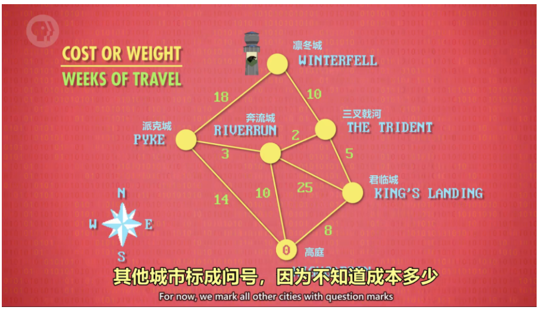

# 算法入门

## 基本慨念

算法：解决问题的基本步骤，是解题方案的准确而完整的描述

---

## 大O表示法

大O表示法（算法）的复杂度：算法的输入大小和运行步骤之间的关系，来表示运行速度的量级

---

## 选择排序

数组：一组数据

选择排序的复杂度为O(n²)

---

## 归并排序

归并排序的算法复杂度为O(n*log n)，n是需要比较+合并的次数，和数组大小成正比，log n是合并步骤所需要的的次数，归并排序比选择排序更有效率

---

## Dijkstra算法

一开始复杂度为O(n²)，后来复杂度为O（nlog n + l），在下图中，n表示节点数，l表示有多少条线。

