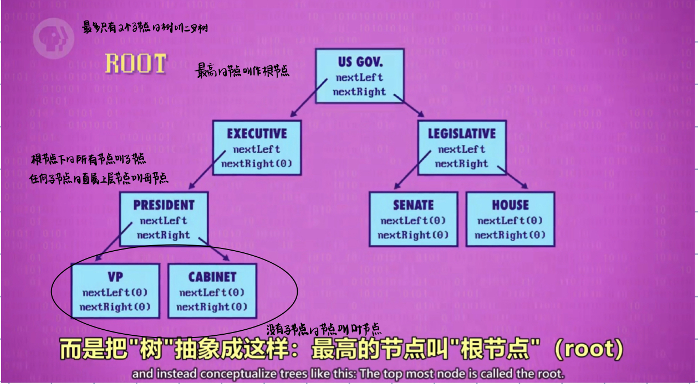
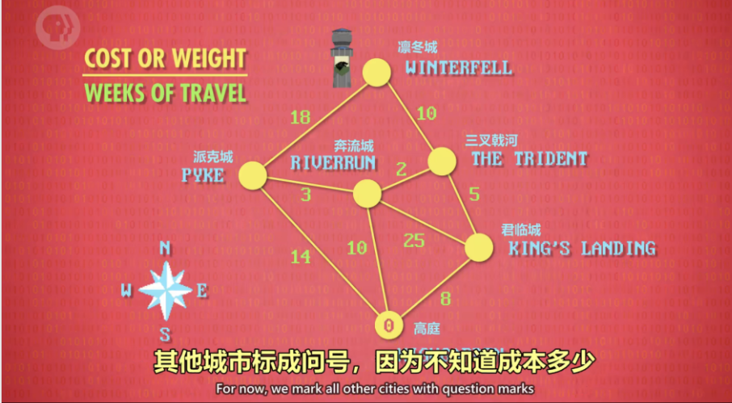

# 数据结构

## 数组

数组（Array），也叫列表（List）或向量（Vector），是一种数据结构。

为了拿出数组中某个值，我们要指定一个下标（index），大多数编程语言里，数组下标都从 0 开始，用方括号`[ ]`代表访问数组。

注意：很容易混淆 "数组中第 5 个数" 和 "数组下标为 5 的数"，数组下标为5的数是数组里面的第6个数。

---

## 字符串

即字母/数字/标点等组成的数组，字符串在内存里以0结尾。

---

## 矩阵

可以把矩阵看成数组的数组(二维数组)。

---

## 结构体/类

把几个有关系的变量存在一起叫做结构体/类，一般用字典存储。

---

## 指针

指针是一种特殊变量，指向一个内存地址，因此得名。

---

## 节点

以指针为变量的结构体叫节点。

---

## 链表

用节点可以做链表，链表是一种灵活数据结构，能存很多个 节点 (node)，灵活性是通过每个节点 指向 下一个节点实现的。链表可以是循环的也可以是非循环的，非循环的最后一个指针是0。

---

## 队列

"队列" 就像邮局排队，谁先来就排前面，这叫 先进先出(FIFO——first in first out)，可以把"栈"想成一堆松饼,做好一个新松饼，就堆在之前上面,吃的时候，是从最上面开始。

---

## 栈

栈是后进先出(LIFO)。

---

## 树

---

## 图

如果数据任意连接且有循环，我们称之为图。

