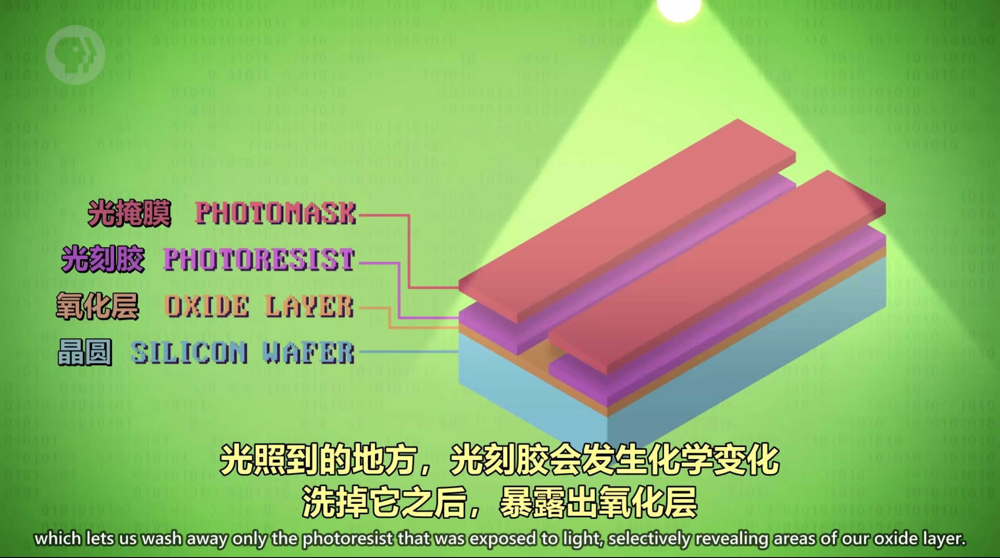
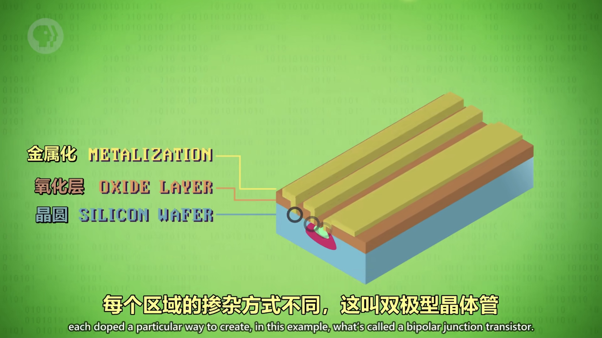

# 集成电路与摩尔定律

## 分立元件与数字暴政

一开始，计算机都有独立组件构成，叫 `分立元件`，然后不同组件再用线连在一起，这会导致计算机的构成很复杂，这个问题叫做`数字暴政`。

---

## 集成电路与仙童半导体

与其把多个独立部件用电线连起来，拼装出计算机，不如把多个组件包在一起，变成一个新的独立组件。

这种新的独立组件就叫`集成电路（IC）`，仙童半导体（用硅做成）让`集成电路`变成了现实。为了不用焊接或用一大堆线，发明了`印刷电路板（PCB）`，他通过蚀刻金属线的方式把零件连接到一起。

---

## 光刻0421

即用光把复杂图案印到材料上。

我们把一片薄片状的硅叫做`晶圆`，通过一系列生产步骤，将晶圆表面薄膜的特定部分除去的工艺叫做`光刻`。

---

## 摩尔定律

每两年左右，得益于材料和制造技术的发展 ，同样大小的空间，能塞进两倍数量的晶体管。

---

## 瓶颈问题

1. **光波长限制**：由于光的波长限制，精度已到极限。
2. **量子隧穿效应**：当晶体管非常小，电极之间可能只距离几个原子，电子会跳过间隙，会产生漏电问题
