# 压缩

## 压缩的好处

能存更多文件，传输也更快。

---

## 游程编码（Run-Length Encoding）

适合经常出现相同值的文件，以吃豆人游戏为例：

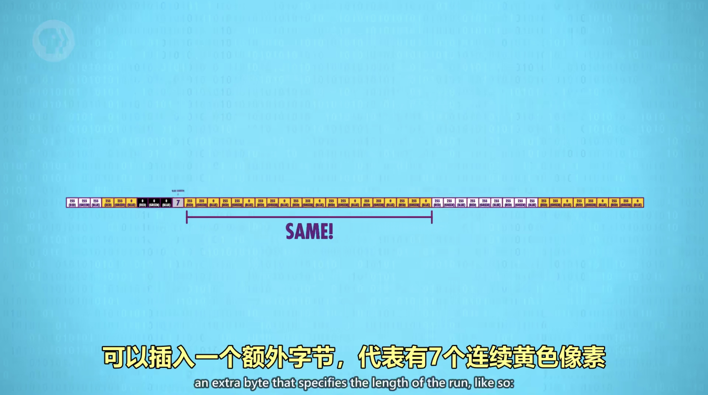

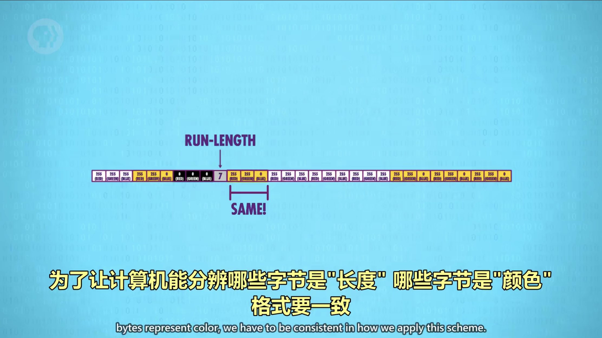

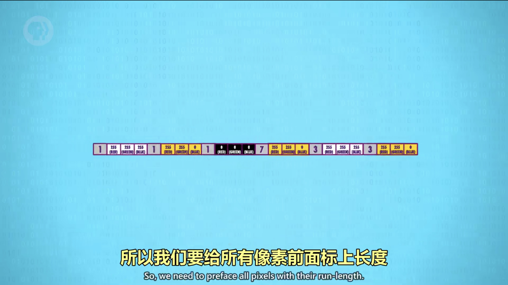

---

## 无损压缩（Lossless compression）

没有损失任何数据的压缩。

---

## 霍夫曼树（Huffman Tree）和字典编码（Dictionary coders）

一种高效的编码模式，以压缩图片为例：

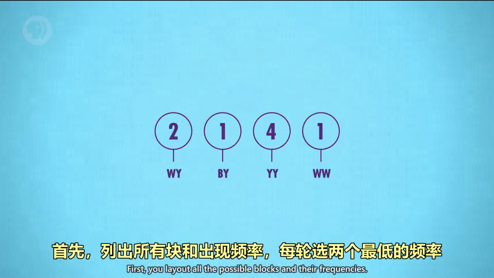

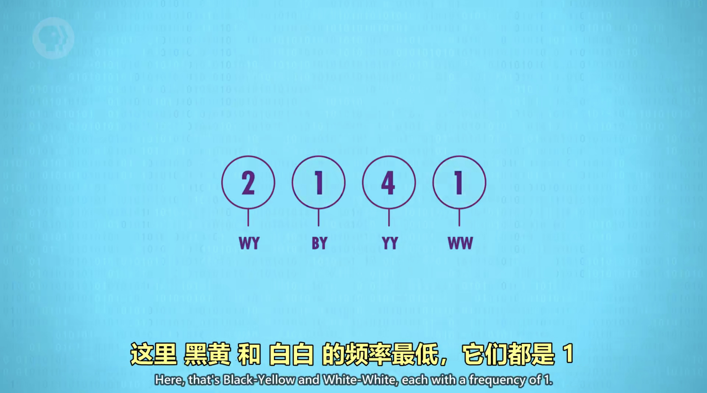

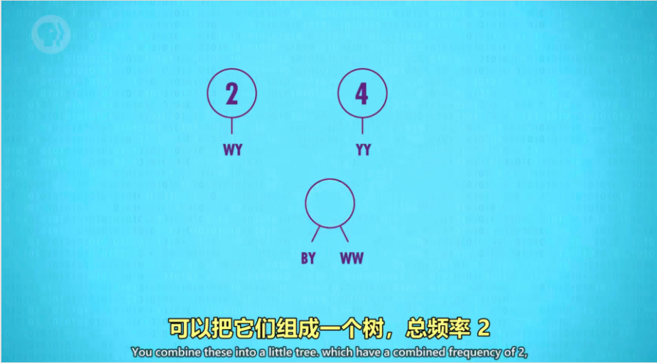

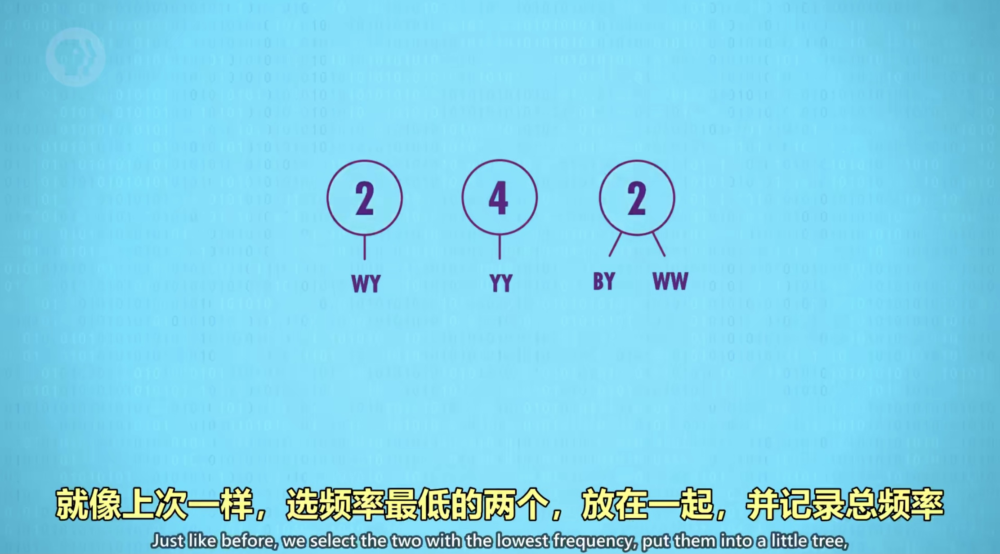

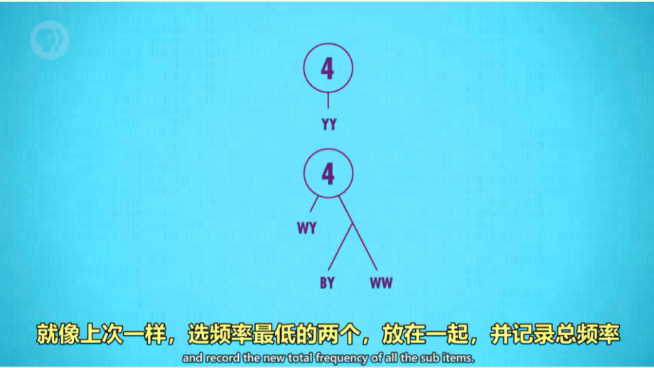

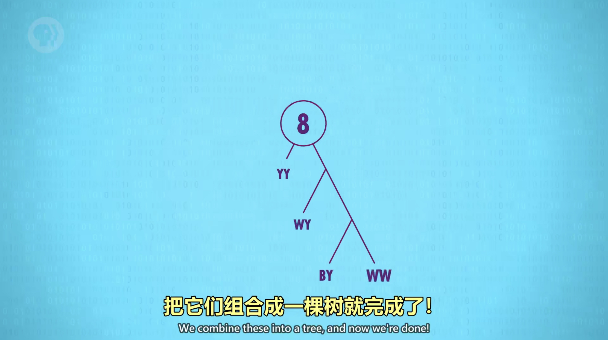

---

## 感知编码（Perceptual coding）和有损压缩

删掉人类无法感知的数据的有损压缩方法，叫做“感知编码”，如音频文件，人类听不到超声波，所以可以舍去，MP3就是音频的一种压缩形式。

有损压缩的一个例子就是jpeg模式，如图：

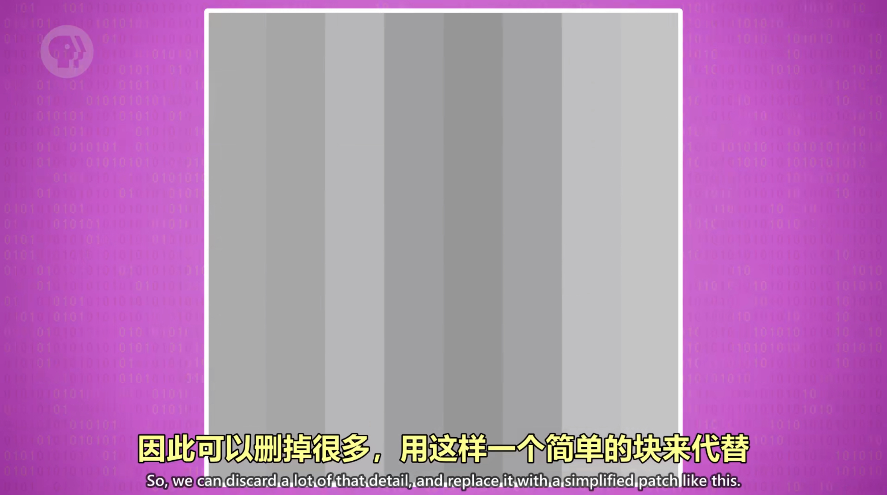

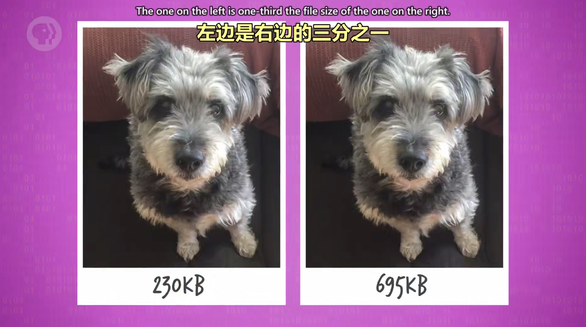

---

## 时间冗余（Temporal redundancy）

一个视频由很多图片构成，其中很多图片的背景一样，这就构成了时间冗余，很多视频编码格式，只存变化的部分。

进阶的视频压缩模式会找到帧与帧的相似性，然后打补丁，MPEG-4 是视频压缩的常见标准。
