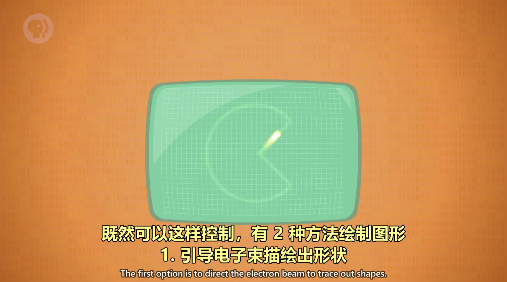
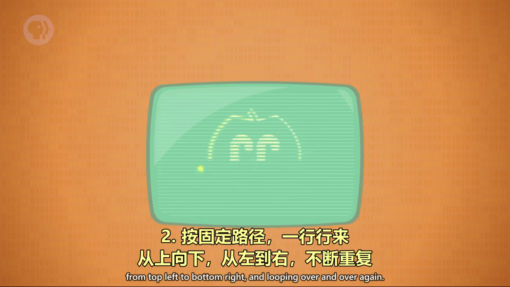

# 屏幕与 2D 图形显示

## PDP-1 计算机

键盘和显示器分开，屏幕显示临时值。

---

## 阴极射线管 CRT（Cathode Ray Tube）

CRT 有两种绘图方式：

1. 矢量扫描（Vector Scanning）
   

2. 光栅扫描（Raster Scanning）
   

---

## 液晶显示器 LCD（Liquid Crystal Displays）

随着显示技术的发展，出现了LCD，LCD 也用光栅扫描。

在屏幕上显示的清晰的点，叫`像素`。

---

## 字符生成器（Character generator）

相比于像素，为了减少内存，人们更喜欢使用字符，计算机需要额外硬件，来从内存读取字符，转换成光栅图形。这样才能显示到屏幕上。

这个硬件叫 "字符生成器"，基本算是第一代显卡。

它内部有一小块只读存储器，简称 ROM，存着每个字符的图形，叫`点阵图案`。

---

## 屏幕缓冲区（Screen buffer）

为了显示，"字符生成器" 会访问内存中一块特殊区域，这块区域专为图形保留，叫屏幕缓冲区，程序想显示文字时，修改这块区域里的值就行。

---

## 矢量命令画图

所有东西都由线组成，矢量指令可以画出线，把许多矢量指令存在硬盘上，就能画出很多由线组成的复杂图形。

---

## SketchPad

SketchPad ，一个交互式图形界面，用途是计算机辅助设计 (CAD)。
- 光笔：一个有线连着电脑的触控笔，有了它们，用户可以画出很完美的线条并进行缩放等操作。
- 位图显示：内存中的位对应着屏幕上显示的像素。
- 绘图操作：想画更复杂的图形，如画矩形，我们需要四个值，起点的x坐标、y坐标、高度和宽度。
