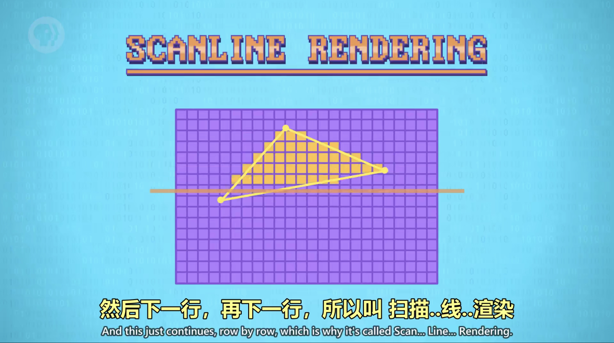
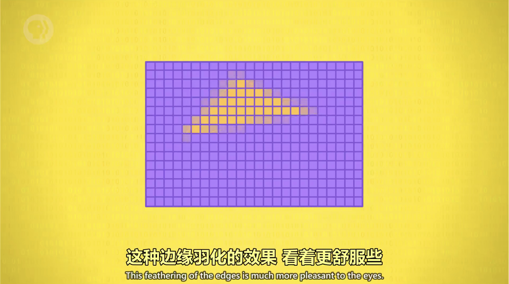
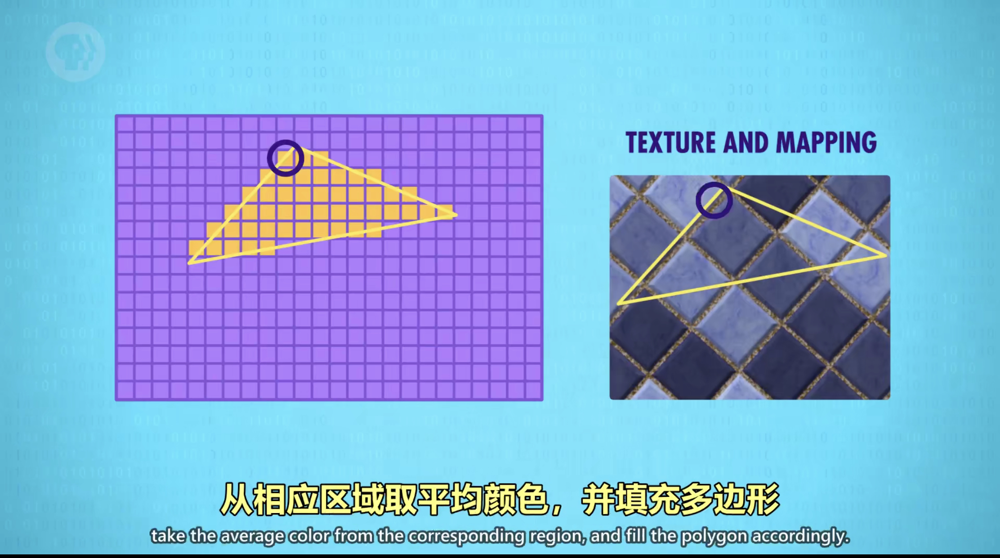

# 屏幕与 3D 图形显示

## 线框渲染（Wireframe Rendering）

- 有图形算法负责把3D坐标"拍平"显示到2D屏幕上，这叫`3D投影(包括正交投影和透视投影)`。
- 所有的点都从3D转成2D后，就可以用画2D线段的函数来连接这些点，这叫`线框渲染`。

---

## 网格（Mesh）

- 如果我们需要画比立方体复杂的图形，三角形比线段更好，在3D图形学中我们叫`三角形"多边形"(Polygons)`。
- 一堆多边形的集合叫`网格`，网格越密，表面越光滑，细节越多。
- 三角形更常用因为能定义唯一的平面。

---

## 扫描线渲染（Scanline Rendering）

1. **填充速率**：填充的速度叫做填充速率。
   
2. **抗锯齿**：边缘羽化，如果像素在多边形内部，就直接涂颜色，如果多边形划过像素，颜色就浅一些。
   

---

## 遮挡（Occlusion）

1. **画家算法**：用排序算法，从远到近排列，然后从远到近渲染，这叫画家算法。

---

## 深度缓冲（Z Buffering）

简而言之，Z-buffering 算法会记录场景中每个像素和摄像机的距离，在内存里存一个数字矩阵，首先，每个像素的距离被初始化为"无限大"，然后 Z-buffering 从列表里第一个多边形开始处理，也就是A，它和扫描线算法逻辑相同，但不是给像素填充颜色，而是把多边形的距离和 Z-Buffer 里的距离进行对比，它总是记录更低的值，因为没对多边形排序，所以后处理的多边形并不总会覆盖前面的。

1. **对抗法（Fighting）**：采用深度缓冲算法，哪个图形在前将会变化。
2. **背面剔除（Back Face Culling）**：由于游戏角色的头部或地面，只能看到朝外的一面，所以为了节省处理时间，会忽略多边形背面，这很好,但有个bug是 如果进入模型内部往外看，头部和地面会消失。
3. **表面法线（Surface Normal）**：在3D图形上任取一小个区域，它面对的方向叫“表面法线”。
4. **平面着色（Flat Shading）**：基本的照明算法，缺点是使多边形边界明显，看上去不光滑。
5. **高洛德着色（Gouraud shading）/ 冯氏着色（Phong Shading）**：不只用一种颜色上色。
6. **纹理映射（Texture Mapping）**：纹理在图形学中指外观，纹理有多种算法来达到花哨效果，最经典的是纹理映射。
   

---

## 图形处理单元 GPU（Graphics Processing Unit）

可并行的处理多个图形，并把图形分成一个个小块来处理。
