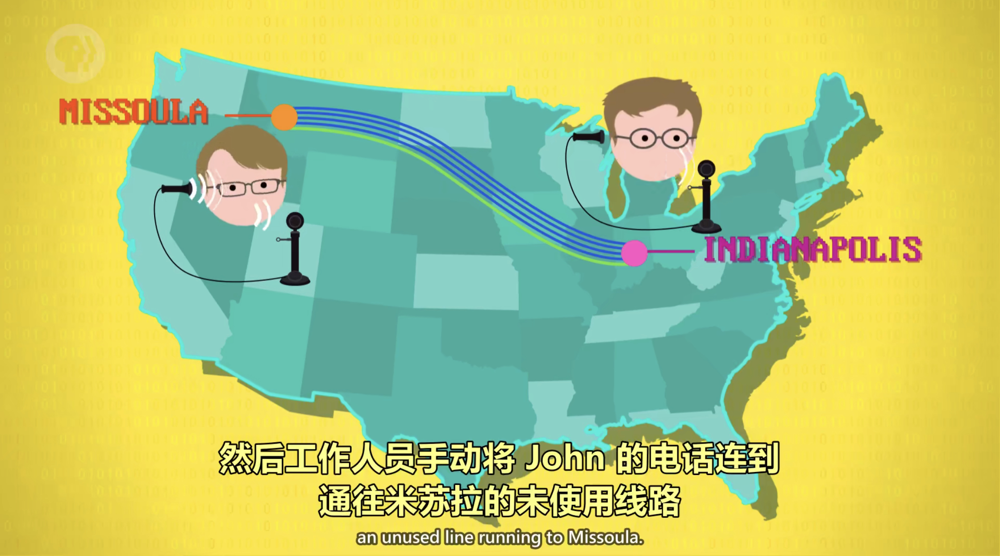
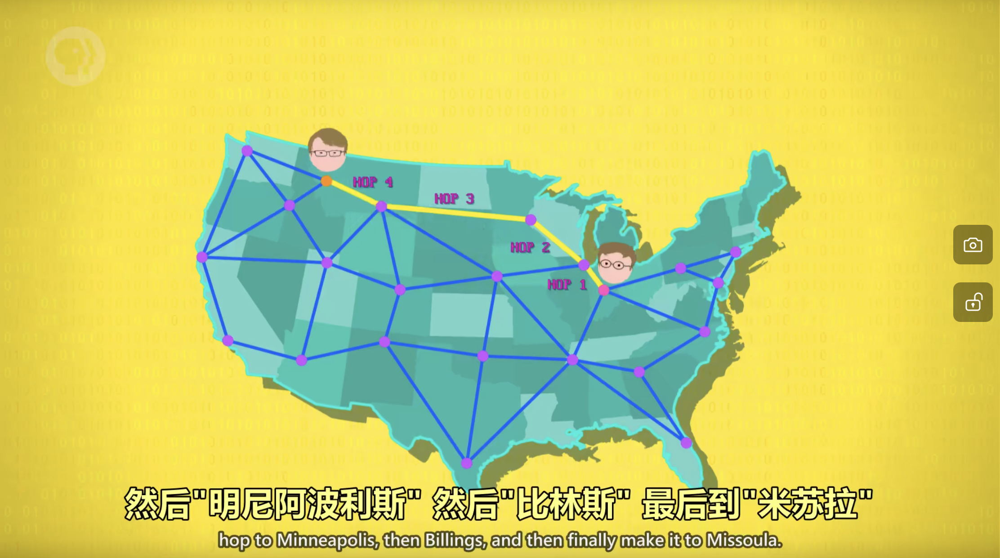

# 计算机网络

## 局域网 LAN（Local Area Networks）

计算机近距离构成的小型网络，叫**局域网（LAN）**，以太网是经典的局域网。

---

## 媒体访问控制地址 MAC（Media Access Control address）

用于确认局域网和WiFi传输的对象。

---

## 载波侦听多路访问 CSMA（Carrier Sense Multiple Access）

- 多台电脑共享一个传输媒介，叫做**载波侦听多路访问**。
- 共享媒介又称**载体**，如 WiFi 的载体是空气，以太网的载体是电线。
- 载体传输数据的速度叫**带宽**。

---

## 指数退避（Exponential Backoff）

当多台计算机同时想要传输数据时，就会发生冲突，当计算机检测到冲突，就会在重传之前等待一小段时间，这一段时间包括固定时间+随机时间，再次堵塞时固定时间将会指数级增加，这叫做**指数退避**。

---

## 冲突域（Collision Domain）

载体和其中的设备总称为**冲突域**，为了避免冲突，可以用**交换器**。

1. 电路交换（Circuit Switching）
   - 依靠人工。
   - 不灵活。
   - 费用昂贵。
   
   

2. 报文交换（Message Switching）
   - 报文的具体格式简称IP，每一个电脑都会有一个**IP地址**。
   - 好处是可以用不同路由，通信更可靠也更能容错。
   - 坏处是当报文比较大的时候，会堵塞线路。解决方法是将大报文分成很多小块，叫**数据包**，来进行运输，这叫**分组交换**。
   - 路由器会平衡与其他路由器之间的负载，以确保传输可以快速可靠，这叫**阻塞控制**。
   - 消息沿着路由跳转的次数 叫**跳数(hop count)**，看到哪条线路的跳数很高，说明出了故障。

   
