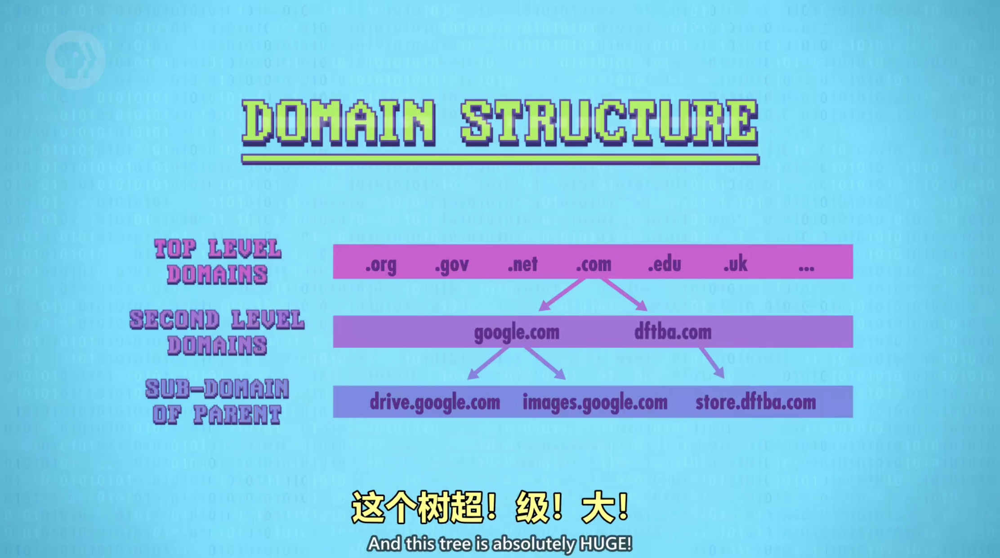
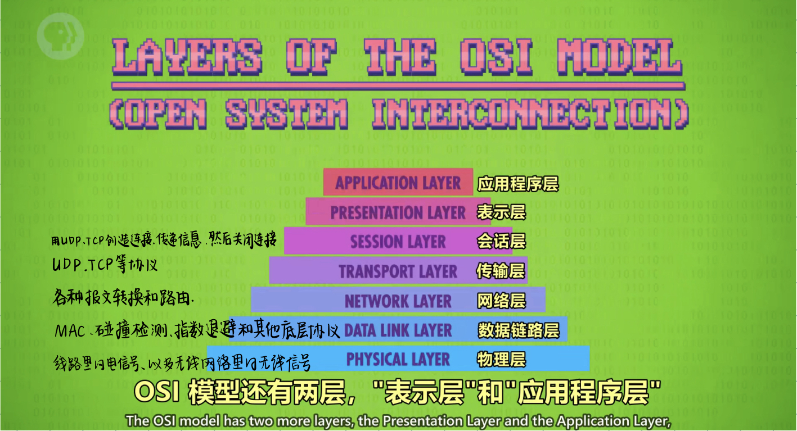

# 互联网

## 连接过程

电脑首先要连接到**局域网**，家里WiFi路由器连着的所有设备，组成了局域网，局域网再连到**广域网（WAN）**，广域网的路由器一般属于你的**互联网服务提供商（ISP）**，再连更大的WAN，往复几次，最后连到互联网主干。

---

## 互联网协议 IP（Internet Protocol）

IP负责把**数据包**送到正确的计算机。

---

## 用户数据报协议 UDP（User Datagram Protocol）

UDP负责把数据包传送到正确的程序，有**端口号**（哪个程序），**校验和**（数据是否损坏）。

- UDP校验和只有16位，超过这个数，弃高位。

---

## 传输控制协议 TCP（Transmission Control Protocol）

如果要控制所有数据必须到达，就用传输控制协议。

- 控制发送的文件接收后按序重排。
- 要求接收方确认无误后发送确认码（ACK），确认码的成功率和来回时间可以用来推测网络的拥堵程度，TCP可以根据这个调整传输率。
- TCP对时间要求高的程序不适用。

---

## 域名系统 DNS（Domain Name System）

计算机访问网站时需要两样，IP地址和端口号，但记数字很难，所以互联网通过域名系统把域名和IP地址一一对应。

域名系统是树状结构。

---

## 开放式系统互联通信参考模型 OSI（Open System Interconnection）

