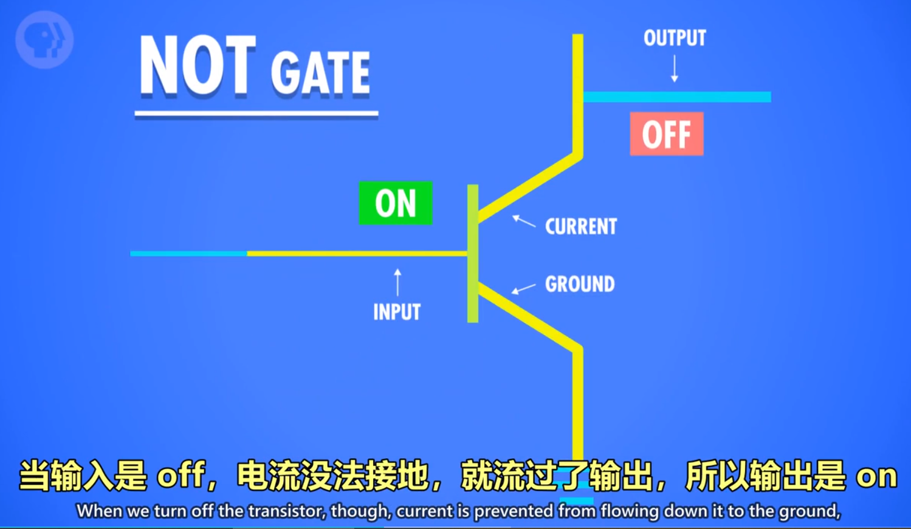
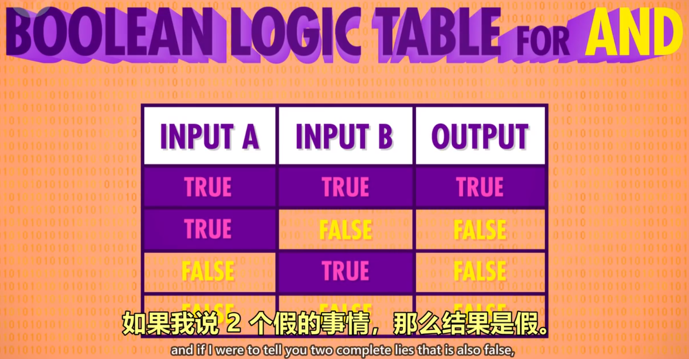
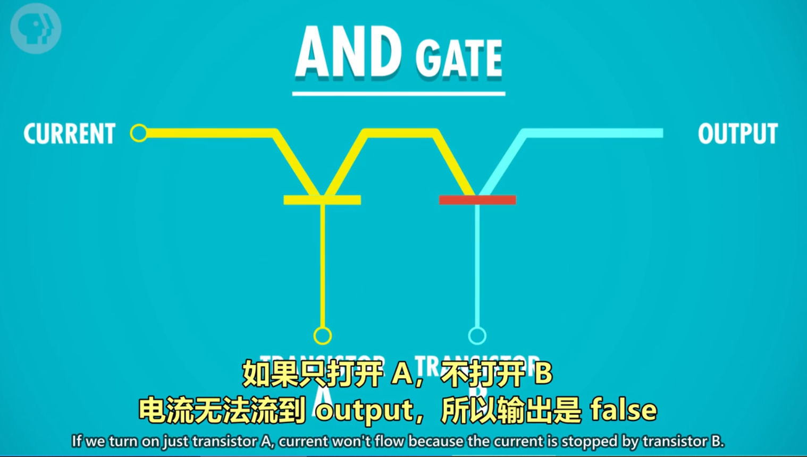
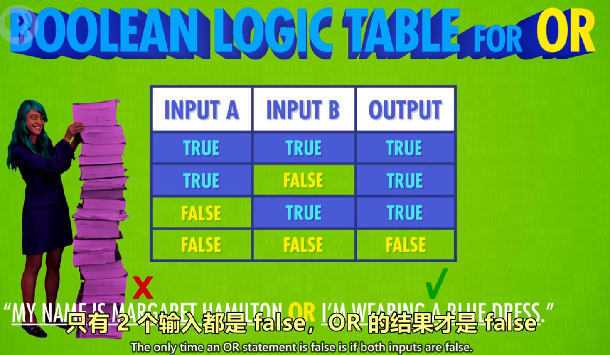
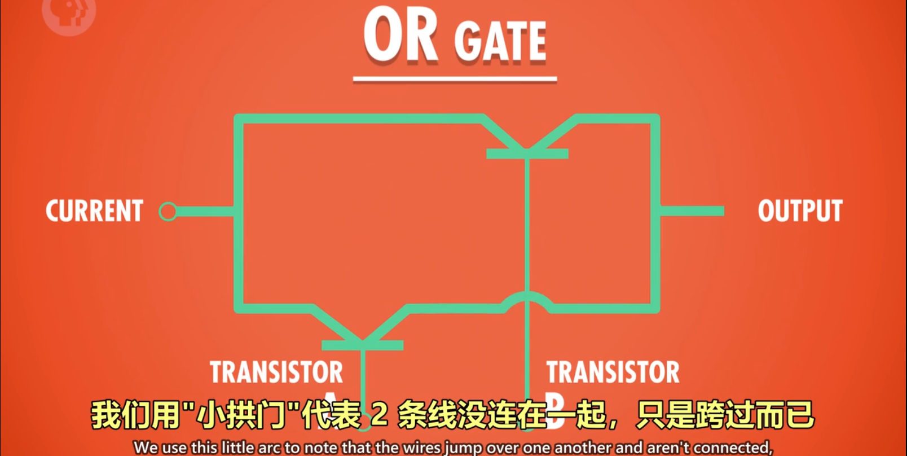

# 布尔逻辑与逻辑门

## 计算机为什么使用二进制

1. 计算机的元器件晶体管只有 2 种状态，`通电（1）` & `断电（0）`，用二进制可直接根据元器件的状态来设计计算机。
2. 而且，数学中的“布尔代数”分支，可以用 `True` 和 `False`（可用 `1` 代表 `True`，`0` 代表 `False`）进行逻辑运算，代替实数进行计算。
3. 计算的状态越多，信号越容易混淆，影响计算。对于当时每秒运算百万次以上的晶体管，信号混淆是特别让人头疼的的。

---

## 布尔代数在计算机中的实现

1. 变量：没有常数，仅 `True` 和 `False` 这两个变量。
2. 三个基本操作：`NOT`/`AND`/`OR`。
3. 为什么称之为“门”：控制电流流过的路径

### NOT 操作

1. 命名：称为 NOT 门/非门。
2. 作用：将输入布尔值反转。输入的 True 或 False，输出为 False 或 True。
3. 晶体管的实现方式：
   - 半导体通电 True，则线路接地，无输出电流，为 False。
   - 半导体不通电 False，则输出电流从右边输出，为 True。

   

### AND 操作

1. 命名：AND 门/与门
2. 作用：由 2 个输入控制输出，仅当 2 个输入 input1 和 input2 都为 True 时，输出才为 True，2 个输入的其余情况，输出均为 False。

   

3. 用晶体管实现的方式：
   - 串联两个晶体管，仅当 2 个晶体管都通电，输出才有电流（True）

   

### OR 操作

1. 命名：OR 门/或门
2. 作用：由 2 个输入控制输出，只要其中一个输入为 True，则输出 True。

   

3. 用晶体管实现的方式：
   - 使用 2 个晶体管，将它们并联到电路中，只要有一个晶体管通电，则输出有电流（True）。

   

---

## 特殊的逻辑运算 —— 异或

1. 命名：XOR 门/异或门
2. 作用：2 个输入控制一个输出。当 2 个输入均为 True 时，输出 False，其余情况与 OR 门相同。

   

3. 图示：
   - 先用一个 OR 门，将其与 AND 门并联，AND 门与 NOT 门串联，最后让 NOT 与 AND 门并联，获得输出。

   

---

## 逻辑门的符号表示

1. 作用：将逻辑门简化，将逻辑门用于构建更大的组件，而不至于太复杂。
2. 图示：
   - 非门：用三角形+圆圈表示
   - 与门：用 D 型图案表示
   - 或门：用类似 D 向右弯曲的图案表示
   - 异或门：用或门+一个圆弧表示

   

---

## 抽象的好处

使得分工明确，不同职业的工程师各司其职,而不用担心其他细节。
