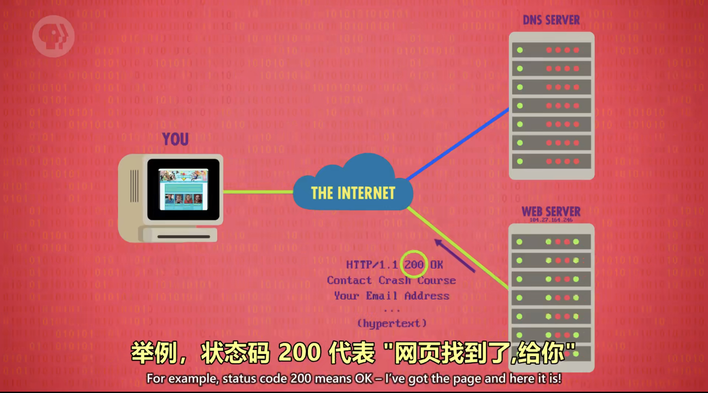

# 万维网

## 基本介绍

- **万维网**在互联网上运行，它的基本单位是**页面**。
- **互联网**是线路、协议以及通过TCP/IP协议实现数据电子传输的硬件和软件的集合体。
- 互联网提供的主要服务有**万维网(WWW)**、**文件传输（FTP)**、**电子邮件E-mail**、**远程登录（Telnet）**等。

---

## 超链接（Hyperlinks）

点超链接可以去到另一个页面，文字超链接又叫超文本。

状态码代表所访问网页的状态。

---

## 统一资源定位器 URL（Uniform Resource Locator）

统一资源定位器是因特网的万维网服务程序上用于指定信息位置的表示方法。它最初是由蒂姆·伯纳斯·李发明用来作为万维网的地址。现在它已经被万维网联盟编制为互联网标准 RFC1738。

---

## 超文本传输协议 HTTP（HyperText Transfer Protocol）

超文本传输协议是一个简单的请求-响应协议，它通常运行在 TCP 之上。它指定了客户端可能发送给服务器什么样的消息以及得到什么样的响应。请求和响应消息的头以 ASCII 形式给出；而消息内容则具有一个类似MIME的格式。这个简单模型是早期 Web 成功的有功之臣，因为它使开发和部署非常地直截了当。

---

## 超文本标记语言 HTML（HyperText Markup Language）

超文本标记语言包括一系列标签．通过这些标签可以将网络上的文档格式统一，使分散的 Internet 资源连接为一个逻辑整体。HTML 文本是由 HTML 命令组成的描述性文本，HTML 命令可以说明文字，图形、动画、声音、表格、链接等。

---

## 万维网发展史

1. 第一个浏览器和服务器是 Tim Berners-Lee 花了 2 个月在 CERN 部署成功。
2. 1991年万维网就此诞生。
3. Jerry 和 David 的万维网指南 后来改名成 Yahoo。
4. 搜索引擎 JumpStation（包括爬虫 索引 用法）。
5. 搜索引擎 Google，改进排序方法，按照链接指向的多少来排序。

---

## 网络中立性（Net Neutrality）

网络中立性是关于网络在作为一个应用程序层的操作平台上的一些原则，引用Wikipedia的话来说，这些原则就是“非歧视性的互联互通”，是指网络运营者（所有者）不得通过调整网络配置使服务产生差别，即平等对待所有使用该网络的用户。

通俗的说就是平等地对待每个数据包。
