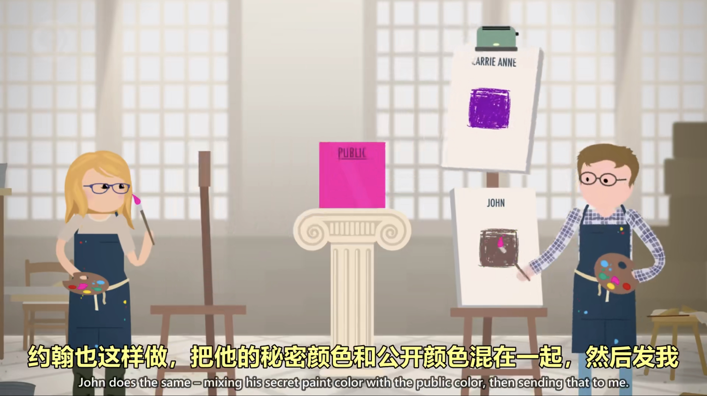

# 加密

## 加密（Encryption）、解密（Decryption）

- **替换加密（Substitution cipher）**：把字母替换成其他字母。
  - 凯撒加密（Caesar cipher）：一种替换加密。

- **移位加密（Permutation cipher）**：一种简单的移位加密。
  - 列移位加密（Columnar transposition cipher）：如图。
    

- **德国 Enigma 加密**：一种进阶的替换加密，每一次的映射都不同。
- **数据加密标准 DES（Data Encryption Standard）**：一种对称密钥加密块密码算法，1976年被美国联邦政府的国家标准局确定为联邦资料处理标准（FIPS），随后在国际上广泛流传开来。
- **高级加密标准 AES（Advanced Encryption Standard）**：高级加密标准由美国国家标准与技术研究院（NIST）于2001年11月26日发布于FIPS PUB 197，并在2002年5月26日成为有效的标准。

---

## 密钥交换（Key Exchange）

**单向函数**和**密钥加密**的示意图：

eg: **迪菲-赫尔曼密钥交换（Diffie-Hellman Key Exchange）**：用模幂计算来得到秘钥。

---

## 非对称加密（Asymmetric encryption）

非对称加密就是加密和解密使用的不是相同的密钥：只有同一个公钥 - 私钥对才能正常加解密。

因此，如果小明要加密一个文件发送给小红，他应该首先向小红索取她的公钥，然后，他用小红的公钥加密，把加密文件发送给小红，此文件只能由小红的私钥解开，因为小红的私钥在她自己手里，所以，除了小红，没有任何人能解开此文件。

非对称加密的典型算法就是 RSA 算法，它是由 Ron Rivest，Adi Shamir，Leonard Adleman 这三个哥们一起发明的，所以用他们仨的姓的首字母缩写表示。
