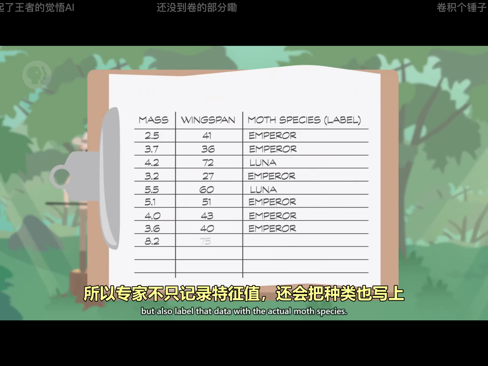
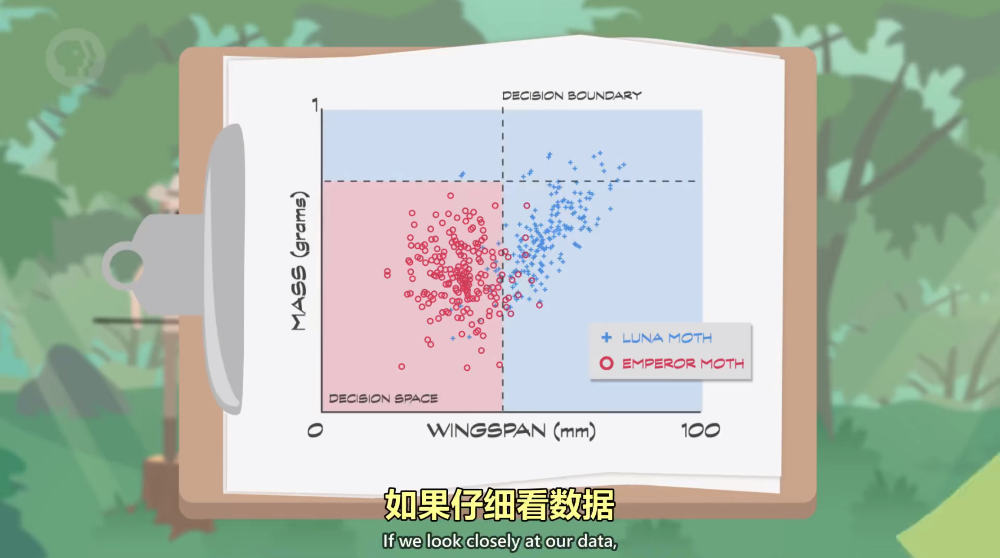
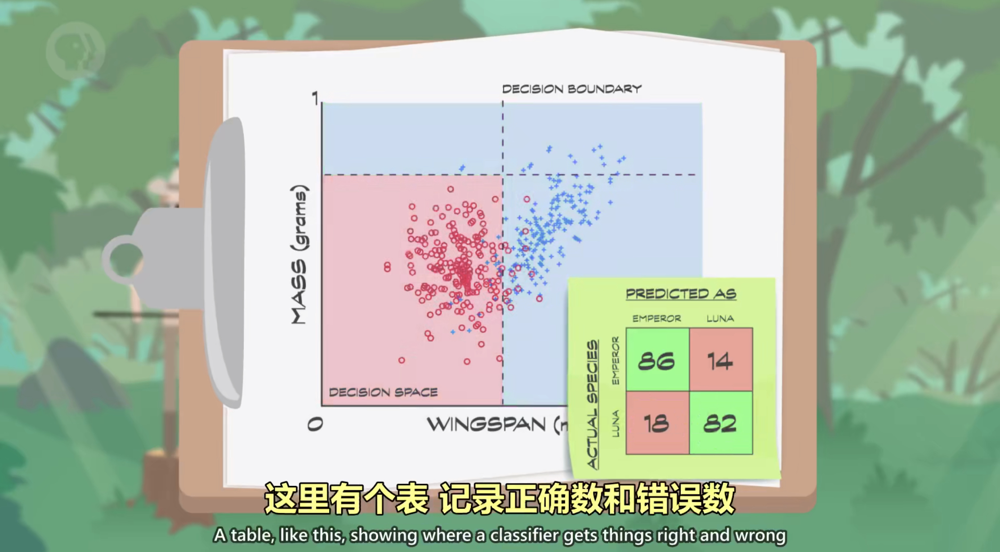
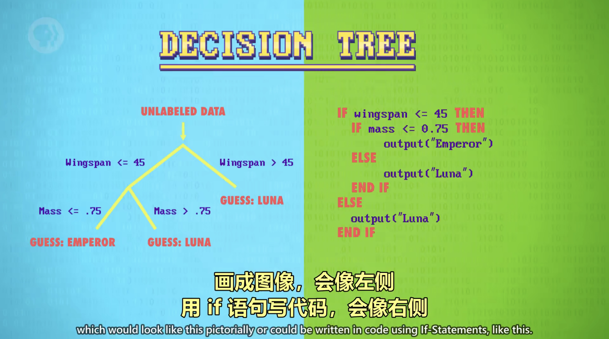
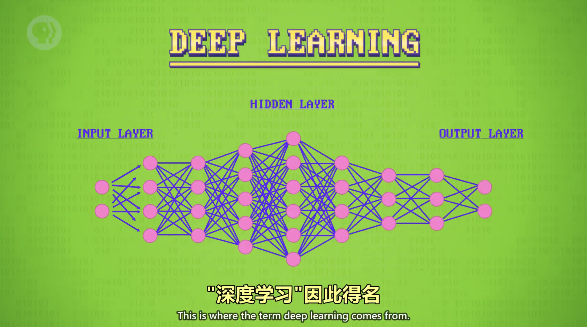

# 机器学习与人工智能

## 分类（Classification）

- **分类器（Classifier）**：做分类的算法。
- **特征（Feature）**：用于分类的值。

- **标记数据（Labeled Data）**：特征值 + 种类。
  

- **决策边界（Decision Boundaries）**：在具有两个类的统计分类问题中，决策边界或决策表面是超曲面，其将基础向量空间划分为两个集合，一个集合。
  
 
- **混淆矩阵（Confusion Matrix）**：混淆矩阵也称误差矩阵，是表示精度评价的一种标准格式，用n行n列的矩阵形式来表示。 具体评价指标有总体精度、制图精度、用户精度等，这些精度指标从不同的侧面反映了图像分类的精度。 在人工智能中，混淆矩阵是可视化工具，特别用于监督学习，在无监督学习一般叫做匹配矩阵。
  

- **决策树（Decision Tree）**：在已知各种情况发生概率的基础上，通过构成决策树来求取净现值的期望值大于等于零的概率，评价项目风险，判断其可行性的决策分析方法，是直观运用概率分析的一种图解法。 由于这种决策分支画成图形很像一棵树的枝干，故称决策树。
  

- **支持向量机（Support Vector Machines）**：本质上是用任意线段来切分决策空间，不一定是直线。

---

## 人工神经网络（Artificial Neural Network）

**人工神经网络**（英语：Artificial Neural Network，ANN），简称**神经网络**（Neural Network，NN）或**类神经网络**，在机器学习和认知科学领域，是一种模仿生物神经网络（动物的中枢神经系统，特别是大脑）的结构和功能的数学模型或计算模型，用于对函数进行估计或近似。神经网络由大量的人工神经元联结进行计算。大多数情况下人工神经网络能在外界信息的基础上改变内部结构，是一种自适应系统，通俗地讲就是具备学习功能。现代神经网络是一种非线性统计性数据建模工具，神经网络通常是通过一个基于数学统计学类型的学习方法（Learning Method）得以优化，所以也是数学统计学方法的一种实际应用，通过统计学的标准数学方法我们能够得到大量的可以用函数来表达的局部结构空间，另一方面在人工智能学的人工感知领域，我们通过数学统计学的应用可以来做人工感知方面的决定问题（也就是说通过统计学的方法，人工神经网络能够类似人一样具有简单的决定能力和简单的判断能力），这种方法比起正式的逻辑学推理演算更具有优势。

---

## 深度学习（Deep Learning）

**深度学习**的概念源于人工神经网络的研究。含多隐层的多层感知器就是一种深度学习结构。

深度学习通过组合低层特征形成更加抽象的高层表示属性类别或特征，以发现数据的分布式特征表示。

---

## 弱人工智能（Weak AI）

**弱人工智能**也称限制领域人工智能（Narrow AI）或应用型人工智能（Applied AI），指的是专注于且只能解决特定领域问题的人工智能。

---

## 强人工智能（Strong AI）

**强人工智能**又称通用人工智能（Artificial General Intelligence）或完全人工智能（Full AI），指的是可以胜任人类所有工作的人工智能。

强人工智能具备以下能力：

- 存在不确定性因素时进行推理，使用策略，解决问题，制定决策的能力。
- 知识表示的能力，包括常识性知识的表示能力。
- 规划能力。
- 学习能力。
- 使用自然语言进行交流沟通的能力。
- 将上述能力整合起来实现既定目标的能力。

---

## 强化学习（Reinforcement Learning）

**强化学习**是机器学习中的一个领域，强调如何基于环境而行动，以取得最大化的预期利益。强化学习是除了监督学习和非监督学习之外的第三种基本的机器学习方法。与监督学习不同的是，强化学习不需要带标签的输入输出对，同时也无需对非最优解的精确地纠正。其关注点在于寻找探索（对未知领域的）和利用（对已有知识的）的平衡。

通俗的来说就是，智能体学习什么管用，什么不管用，自己发现成功的策略。
