# 计算机视觉

## 基本概述

**计算机视觉 CV**（**C**omputer **V**ision）是人工智能领域的一个重要分支。它的目的是：看懂图片里的内容。

本节囊括计算机视觉的基本概念、实现原理、8 个任务和 4 个生活中常见的应用场景。

---

## 计算机视觉为什么重要

人的大脑皮层，有差不多 70% 都是在处理视觉信息。是人类获取信息最主要的渠道，没有之一。

在网络世界，照片和视频（图像的集合）也正在发生爆炸式的增长！

下图是网络上新增数据的占比趋势图。灰色是结构化数据，蓝色是非结构化数据（大部分都是图像和视频）。可以很明显的发现，图片和视频正在以指数级的速度在增长。

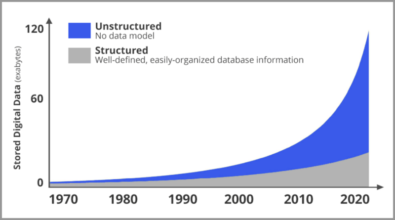

而在计算机视觉出现之前，图像对于计算机来说是黑盒的状态。

一张图片对于机器只是一个文件。机器并不知道图片里的内容到底是什么，只知道这张图片是什么尺寸，多少MB，什么格式的。

如果计算机、人工智能想要在现实世界发挥重要作用，就必须看懂图片！

这就是计算机视觉要解决的问题。

---

## 什么是计算机视觉

计算机视觉是人工智能的一个重要分支，它要解决的问题就是：

**看懂图像里的内容**，比如：

- 图片里的动物是牛还是狗？
- 图片里的人是老张还是老王？
- 这张照片里，这个人在干什么？

---

## 计算机视觉的原理是什么

目前主流的基于深度学习的机器视觉方法，其原理跟人类大脑工作的原理比较相似。

人类的视觉原理如下：从原始信号摄入开始（瞳孔摄入像素 Pixels），接着做初步处理（大脑皮层某些细胞发现边缘和方向），然后抽象（大脑判定，眼前的物体的形状，是圆形的），然后进一步抽象（大脑进一步判定该物体是只气球）。

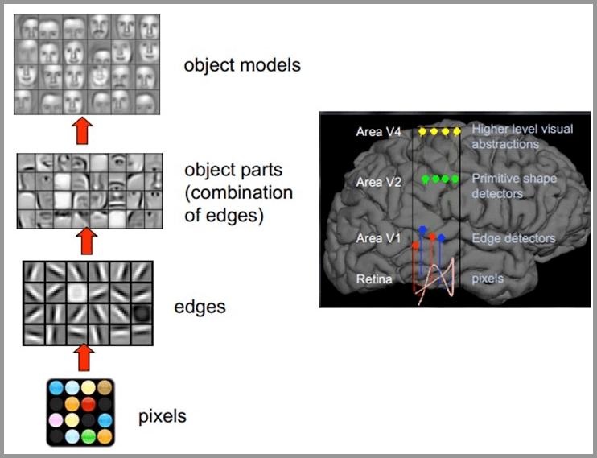

机器的方法也是类似：构造多层的神经网络，较低层的识别初级的图像特征，若干底层特征组成更上一层特征，最终通过多个层级的组合，最终在顶层做出分类。

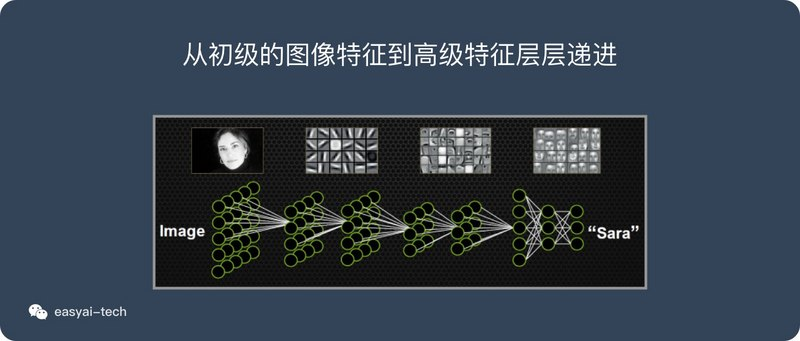

---

## 计算机视觉的两大挑战

对于人类来说看懂图片是一件很简单的事情，但是对于机器来说这是一个非常难的事情，说两个典型的难点：

- **特征难以提取**：

  同一只猫在不同的角度，不同的光线，不同的动作下。像素差异是非常大的。就算是同一张照片，旋转90度后，其像素差异也非常大！

  所以图片里的内容相似甚至相同，但是在像素层面，其变化会非常大。这对于特征提取是一大挑战。

- **需要计算的数据量巨大**：

  手机上随便拍一张照片就是1000*2000像素的。每个像素 RGB 3个参数，一共有1000 X 2000 X 3 = 6,000,000。随便一张照片就要处理 600万 个参数，再算算现在越来越流行的 4K 视频。就知道这个计算量级有多恐怖了。

**CNN 解决了上面的两大难题!**

CNN 属于深度学习的范畴，它很好的解决了上面所说的两大难点：

1. CNN 可以有效的提取图像里的特征
2. CNN 可以将海量的数据（不影响特征提取的前提下）进行有效的降维，大大减少了对算力的要求

---

## 计算机视觉的八大任务

### 图像分类

图像分类是计算机视觉中重要的基础问题。后面提到的其他任务也是以它为基础的。

举几个典型的例子：人脸识别、相册根据人物自动分类等。

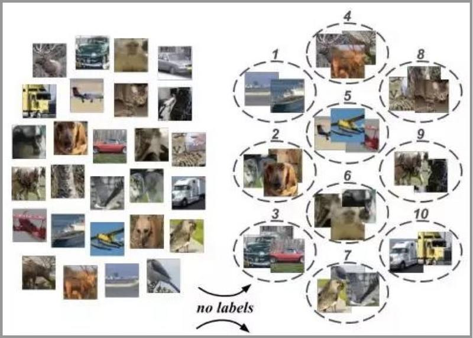

### 目标检测

目标检测任务的目标是给定一张图像或是一个视频帧，让计算机找出其中所有目标的位置，并给出每个目标的具体类别。

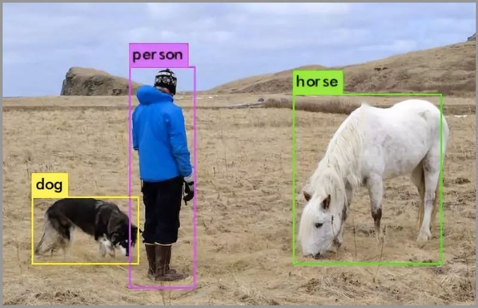

### 语义分割

它将整个图像分成像素组，然后对像素组进行标记和分类。语义分割试图在语义上理解图像中每个像素是什么（人、车、狗、树...）。

如下图，除了识别人、道路、汽车、树木等之外，我们还必须确定每个物体的边界。

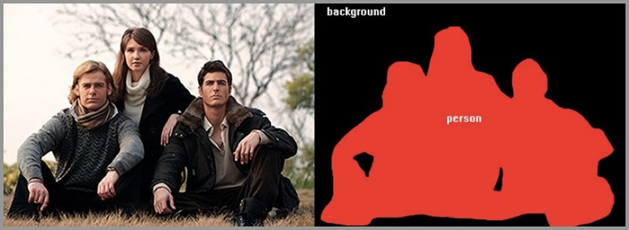

### 实例分割

除了语义分割之外，实例分割将不同类型的实例进行分类，比如用 5 种不同颜色来标记 5 辆汽车。我们会看到多个重叠物体和不同背景的复杂景象，我们不仅需要将这些不同的对象进行分类，而且还要确定对象的边界、差异和彼此之间的关系！

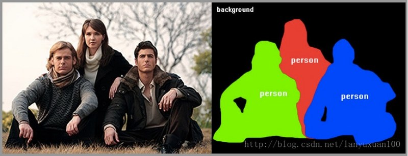

### 视频分类

与图像分类不同的是，分类的对象不再是静止的图像，而是一个由多帧图像构成的、包含语音数据、包含运动信息等的视频对象，因此理解视频需要获得更多的上下文信息，不仅要理解每帧图像是什么、包含什么，还需要结合不同帧，知道上下文的关联信息。

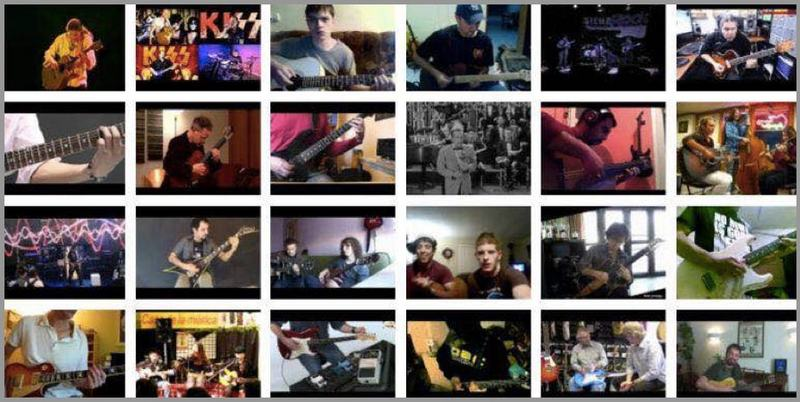

### 人体关键点检测

通过人体关键节点的组合和追踪来识别人的运动和行为，对于描述人体姿态，预测人体行为至关重要。

在 Xbox 中就有利用到这个技术。

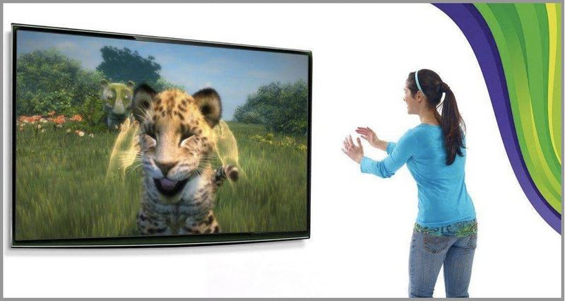

### 场景文字识别

很多照片中都有一些文字信息，这对理解图像有重要的作用。

场景文字识别是在图像背景复杂、分辨率低下、字体多样、分布随意等情况下，将图像信息转化为文字序列的过程。

停车场、收费站的车牌识别就是典型的应用场景。

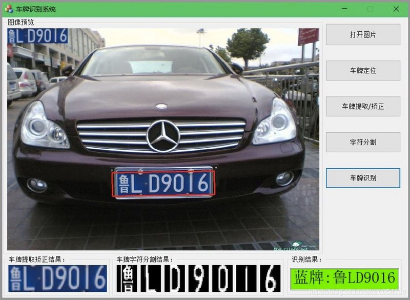

### 目标跟踪

目标跟踪，是指在特定场景跟踪某一个或多个特定感兴趣对象的过程。传统的应用就是视频和真实世界的交互，在检测到初始对象之后进行观察。

无人驾驶里就会用到这个技术。

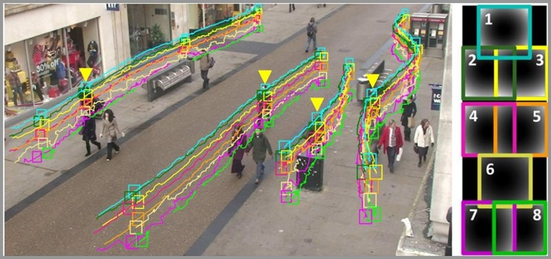

---

## 计算机视觉在日常生活中的应用场景

计算机视觉的应用场景非常广泛，下面列举几个生活中常见的应用场景。

1. 门禁、支付宝上的人脸识别。
2. 停车场、收费站的车牌识别。
3. 上传图片或视频到网站时的风险识别。
4. 抖音上的各种道具（需要先识别出人脸的位置）。

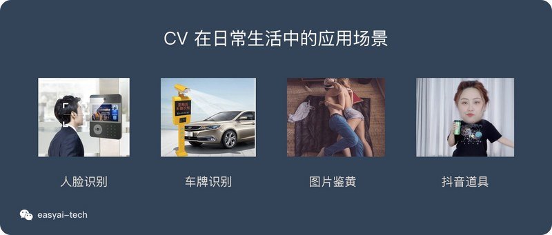

这里需要说明一下，条形码和二维码的扫描不算是计算机视觉。

这种对图像的识别，还是基于固定规则的，并不需要处理复杂的图像，完全用不到 AI 技术。
