# 自然语言处理

## 基本概述

**自然语言处理 NLP** ( **N**atural **L**anguage **P**rocessing )是计算机科学领域与人工智能领域中的一个重要方向。它研究能实现人与计算机之间用自然语言进行有效通信的各种理论和方法。自然语言处理是一门融语言学、计算机科学、数学于一体的科学。因此，这一领域的研究将涉及自然语言，即人们日常使用的语言，所以它与语言学的研究有着密切的联系，但又有重要的区别。自然语言处理并不是一般地研究自然语言，而在于研制能有效地实现自然语言通信的计算机系统，特别是其中的软件系统。因而它是计算机科学的一部分。

自然语言处理主要应用于机器翻译、舆情监测、自动摘要、观点提取、文本分类、问题回答、文本语义对比、语音识别、中文OCR等方面。

网络上有海量的文本信息，想要处理这些非结构化的数据就需要利用 NLP 技术。

本文将介绍 NLP 的基本概念，2大任务，4个典型应用和6个实践步骤。

---

## NLP 为什么重要

> “语言理解是人工智能领域皇冠上的明珠” -- 比尔·盖茨

在人工智能出现之前，机器只能处理结构化的数据（例如 Excel 里的数据）。但是网络中大部分的数据都是非结构化的，例如：文章、图片、音频、视频…

在非结构数据中，文本的数量是最多的，他虽然没有图片和视频占用的空间大，但是他的信息量是最大的。

为了能够分析和利用这些文本信息，我们就需要利用 NLP 技术，让机器理解这些文本信息，并加以利用。

---

## 什么是自然语言处理

每种动物都有自己的语言，机器也是！

自然语言处理（NLP）就是在机器语言和人类语言之间沟通的桥梁，以实现人机交流的目的。

人类通过语言来交流，狗通过汪汪叫来交流。机器也有自己的交流方式，那就是数字信息。

不同的语言之间是无法沟通的，比如说人类就无法听懂狗叫，甚至不同语言的人类之间都无法直接交流，需要翻译才能交流。

而计算机更是如此，为了让计算机之间互相交流，人们让所有计算机都遵守一些规则，计算机的这些规则就是计算机之间的语言。

既然不同人类语言之间可以有翻译，那么人类和机器之间是否可以通过“翻译”的方式来直接交流呢？

NLP 就是人类和机器之间沟通的桥梁！

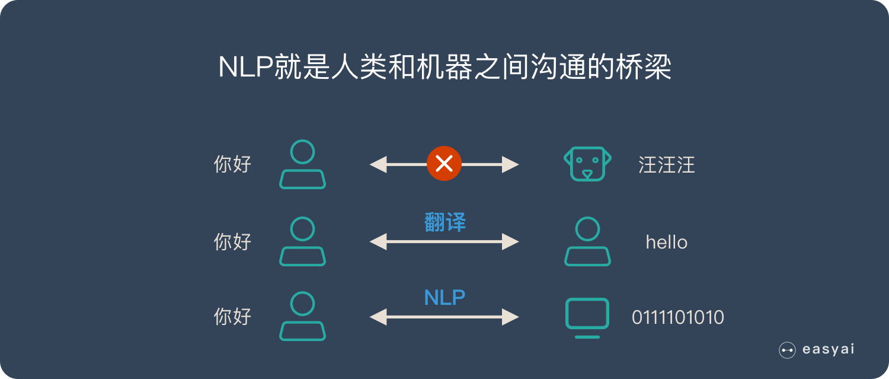

为什么是**自然语言**处理？

自然语言就是大家平时在生活中常用的表达方式，大家平时说的“讲人话”就是这个意思。

---

## NLP 的两大核心任务

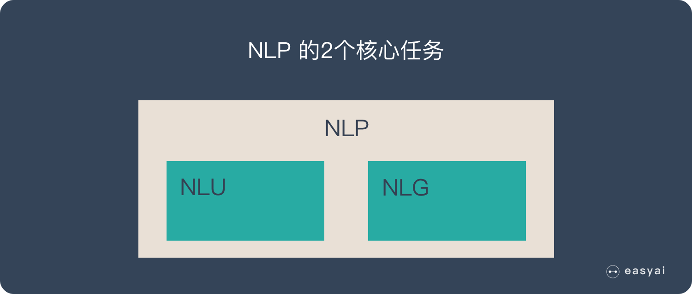

NLP 有2个核心的任务：

- 自然语言理解（NLU/NLI）
- 自然语言生成（NLG）

### 自然语言理解（NLU/NLI）

自然语言理解就是希望机器像人一样，具备正常人的语言理解能力，由于自然语言在理解上有很多难点，所以 NLU 是至今还远不如人类的表现。

自然语言理解的5个难点：

1. 语言的多样性。
2. 语言的歧义性。
3. 语言的鲁棒性。
4. 语言的知识依赖。
5. 语言的上下文。

### 自然语言生成（NLG）

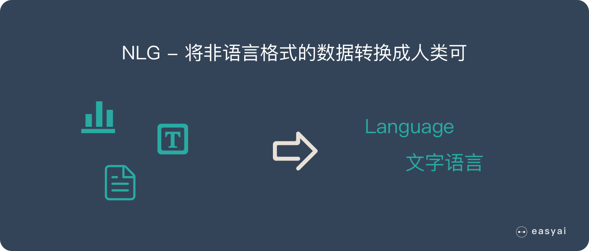

NLG 是为了跨越人类和机器之间的沟通鸿沟，将非语言格式的数据转换成人类可以理解的语言格式，如文章、报告等。

NLG 的6个步骤：

1. 内容确定（Content Determination）
2. 文本结构（Text Structuring）
3. 句子聚合（Sentence Aggregation）
4. 语法化（Lexicalisation）
5. 参考表达式生成（Referring Expression Generation|REG）
6. 语言实现（Linguistic Realisation）

---

## NLP 的五个难点

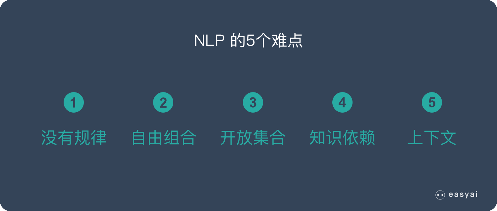

1. 语言是没有规律的，或者说规律是错综复杂的。
2. 语言是可以自由组合的，可以组合复杂的语言表达。
3. 语言是一个开放集合，我们可以任意的发明创造一些新的表达方式。
4. 语言需要联系到实践知识，有一定的知识依赖。
5. 语言的使用要基于环境和上下文。

---

## NLP 的四个典型应用

### 情感分析

互联网上有大量的文本信息，这些信息想要表达的内容是五花八门的，但是他们抒发的情感是一致的：正面/积极的或者负面/消极的。

通过情感分析，可以快速了解用户的舆情情况。

### 聊天机器人

过去只有 Siri、小冰这些机器人，大家使用的动力并不强，只是当做一个娱乐的方式。但是最近几年智能音箱的快速发展让大家感受到了聊天机器人的价值。

而且未来随着智能家居，智能汽车的发展，聊天机器人会有更大的使用价值。

### 语音识别

语音识别已经成为了全民级的引用，微信里可以语音转文字，汽车中使用导航可以直接说目的地，老年人使用输入法也可以直接语音而不用学习拼音…

### 机器翻译

目前的机器翻译准确率已经很高了，大家使用 Google 翻译完全可以看懂文章的大意。传统的人肉翻译未来很可能会失业。

---

## NLP 的两种途径和三个核心步骤

NLP 可以使用传统的机器学习方法来处理，也可以使用深度学习的方法来处理。2 种不同的途径也对应着不同的处理步骤。详情如下：

### 传统机器学习的 NLP 流程

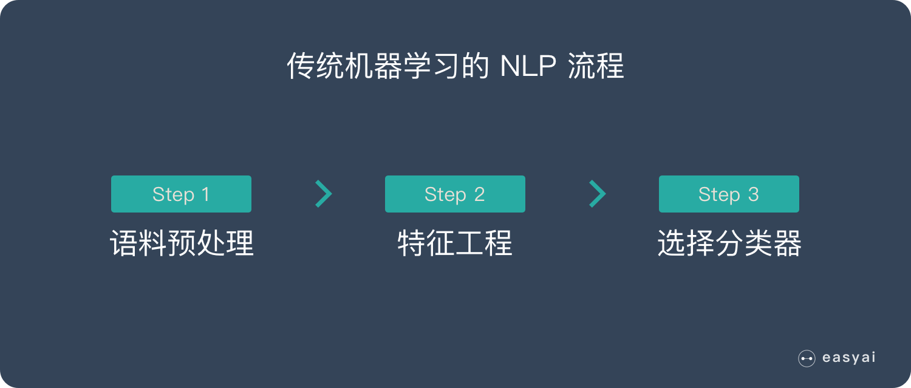

1. 语料预处理
   1. 中文语料预处理 4 个步骤（下文详解）
   2. 英文语料预处理的 6 个步骤（下文详解）
2. 特征工程
   1. 特征提取
   2. 特征选择
3. 选择分类器

### 深度学习的 NLP 流程

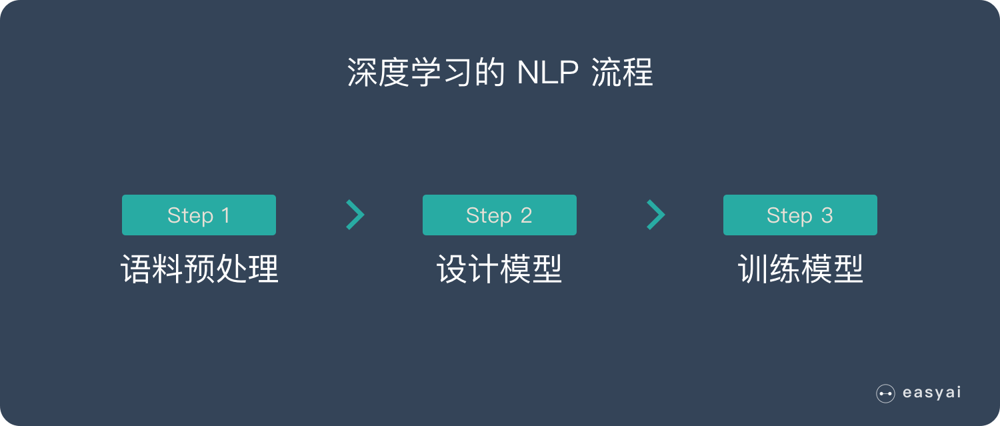

1. 语料预处理
   1. 中文语料预处理 4 个步骤（下文详解）
   2. 英文语料预处理的 6 个步骤（下文详解）
2. 设计模型
3. 模型训练

### 英文 NLP 语料预处理的 6 个步骤

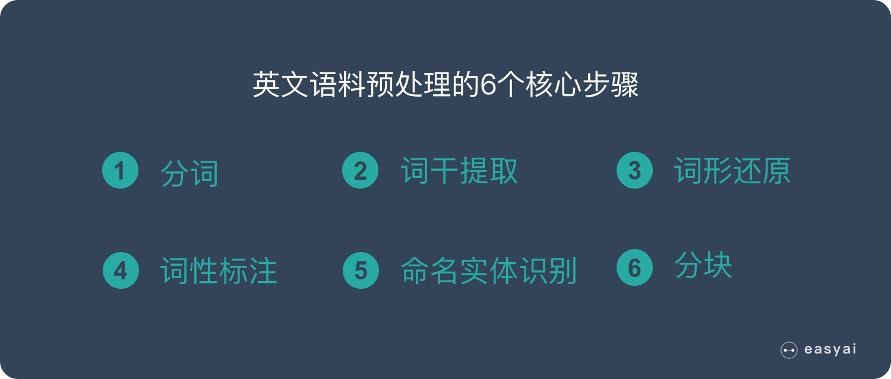

1. 分词（Tokenization）
2. 词干提取（Stemming）
3. 词形还原（Lemmatization）
4. 词性标注（Parts of Speech）
5. 命名实体识别（NER）
6. 分块（Chunking）

### 中文 NLP 语料预处理的 4 个步骤

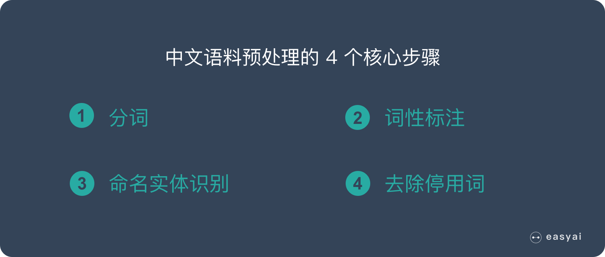

1. 中文分词（Chinese Word Segmentation）
2. 词性标注（Parts of Speech）
3. 命名实体识别（NER）
4. 去除停用词（Remove Stop Words）

---

## 总结

自然语言处理（NLP）就是在机器语言和人类语言之间沟通的桥梁，以实现人机交流的目的。

---

## Appendix: Encoder-Decoder Model Frame

Encoder-Decoder 是 NLP 领域里的一种模型框架。它被广泛用于机器翻译、语音识别等任务。

### 什么是 Encoder-Decoder

Encoder-Decoder 模型主要是 NLP 领域里的概念。它并不特值某种具体的算法，而是一类算法的统称。Encoder-Decoder 算是一个通用的框架，在这个框架下可以使用不同的算法来解决不同的任务。

Encoder-Decoder 这个框架很好的诠释了机器学习的核心思路：

> 将现实问题转化为数学问题，通过求解数学问题，从而解决现实问题。

Encoder 又称作编码器，它的作用就是将现实问题转化为数学问题。

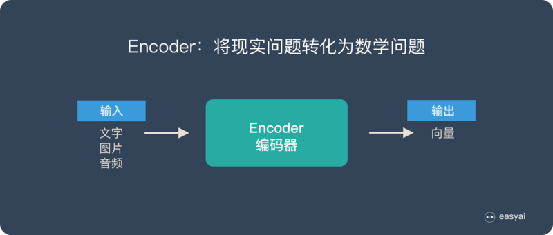

Decoder 又称作解码器，他的作用是求解数学问题，并转化为现实世界的解决方案。

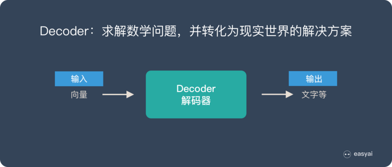

把 2 个环节连接起来，用通用的图来表达则是下面的样子：

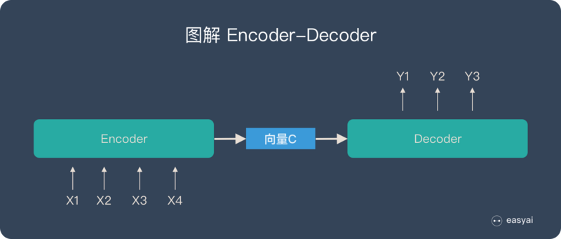

关于 Encoder-Decoder，有2 点需要说明：

1. 不论输入和输出的长度是什么，中间的向量 c 长度都是固定的（这也是它的缺陷，下文会详细说明）。
2. 根据不同的任务可以选择不同的编码器和解码器（可以是一个 RNN ，但通常是其变种 LSTM 或者 GRU ）。

只要是符合上面的框架，都可以统称为 Encoder-Decoder 模型。

### 什么是 Seq2Seq

Seq2Seq（是 Sequence-to-sequence 的缩写），就如字面意思，输入一个序列，输出另一个序列。这种结构最重要的地方在于输入序列和输出序列的长度是可变的。例如下图：

输入了 6 个汉字，输出了 3 个英文单词。输入和输出的长度不同。

#### Seq2Seq 的由来

在 Seq2Seq 框架提出之前，深度神经网络在图像分类等问题上取得了非常好的效果。在其擅长解决的问题中，输入和输出通常都可以表示为固定长度的向量，如果长度稍有变化，会使用补零等操作。

然而许多重要的问题，例如机器翻译、语音识别、自动对话等，表示成序列后，其长度事先并不知道。因此如何突破先前深度神经网络的局限，使其可以适应这些场景，成为了13年以来的研究热点，Seq2Seq框架应运而生。

#### Seq2Seq 和 Encoder-Decoder 的关系

Seq2Seq（强调目的）不特指具体方法，满足输入序列、输出序列的目的，都可以统称为 Seq2Seq 模型。

而 Seq2Seq 使用的具体方法基本都属于Encoder-Decoder 模型（强调方法）的范畴。

总结一下的话：

- Seq2Seq 属于 Encoder-Decoder 的大范畴。
- Seq2Seq 更强调目的，Encoder-Decoder 更强调方法。

### Encoder-Decoder 的应用

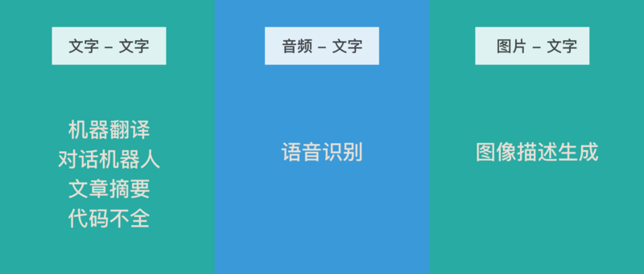

**文本 - 文本**是最典型的应用，其输入序列和输出序列的长度可能会有较大的差异。

Google 发表的用 Seq2Seq 做机器翻译的论文 [Sequence to Sequence Learning with Neural Networks](https://arxiv.org/pdf/1409.3215.pdf)

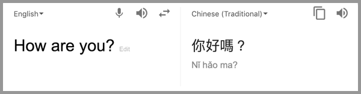

**音频 - 文本**语音识别也有很强的序列特征，比较适合 Encoder-Decoder 模型。

Google 发表的使用Seq2Seq做语音识别的论文 [A Comparison of Sequence-to-Sequence Models for Speech Recognition](https://www.isca-speech.org/archive/Interspeech_2017/pdfs/0233.PDF)

**图片 - 文本**图像描述生成通俗的讲就是看图说话，机器提取图片特征，然后用文字表达出来。

这个应用是计算机视觉和 NLP 的结合。

图像描述生成的论文 [Sequence to Sequence – Video to Text](https://arxiv.org/pdf/1505.00487.pdf)

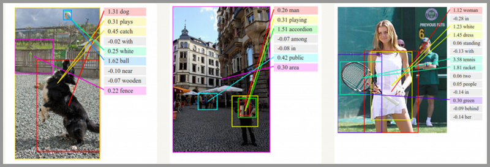

### Encoder-Decoder 的缺陷

Encoder（编码器）和 Decoder（解码器）之间只有一个向量 c 来传递信息，且 c 的长度固定。

为了便于理解，我们类比为压缩-解压的过程：

将一张 800X800 像素的图片压缩成 100KB，看上去还比较清晰。再将一张 3000X3000 像素的图片也压缩到 100KB，看上去就模糊了。

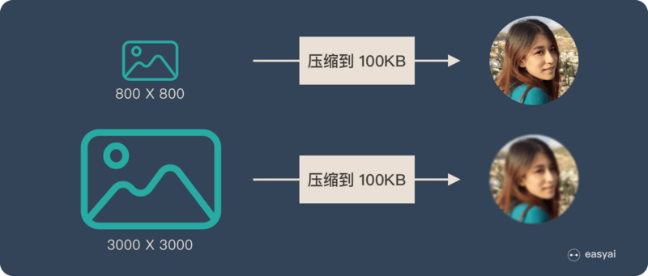

Encoder-Decoder 就是类似的问题：当输入信息太长时，会丢失掉一些信息。

### Attention 解决信息丢失问题

Attention 机制就是为了解决信息过长，信息丢失的问题。

Attention 模型的特点是 Encoder 不再将整个输入序列编码为固定长度的中间向量 c，而是编码成一个向量的序列。引入了 Attention 的 Encoder-Decoder 模型如下图：

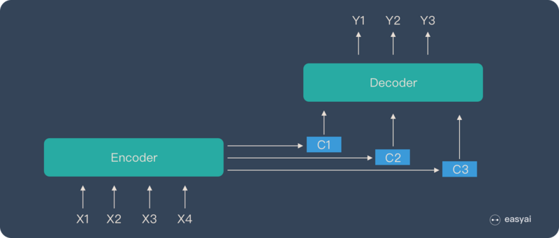

这样，在产生每一个输出的时候，都能够做到充分利用输入序列携带的信息。而且这种方法在翻译任务中取得了非常不错的成果。

---

## AppendixDitto: Attention Mechanism

### Attention 的本质是什么

Attention（注意力）机制如果浅层的理解，跟他的名字非常匹配。他的核心逻辑就是**从关注全部到关注重点**。

Attention 机制很像人类看图片的逻辑，当我们看一张图片的时候，我们并没有看清图片的全部内容，而是将注意力集中在了图片的焦点上。大家看一下下面这张图：

我们一定会看清锦江饭店4个字，如下图：

但是我相信没人会意识到锦江饭店上面还有一串电话号码，也不会意识到喜运来大酒家，所以，当我们看一张图片的时候，其实是这样的：

上面所说的，我们的视觉系统就是一种 Attention 机制，将有限的注意力集中在重点信息上，从而节省资源，快速获得最有效的信息。

Attention 机制最早是在计算机视觉里应用的，随后在 NLP 领域也开始应用了，真正发扬光大是在 NLP 领域，因为 2018 年 BERT 和 GPT 的效果出奇的好，进而走红。而 Transformer 和 Attention 这些核心开始被大家重点关注。

如果用图来表达 Attention 的位置大致是下面的样子：

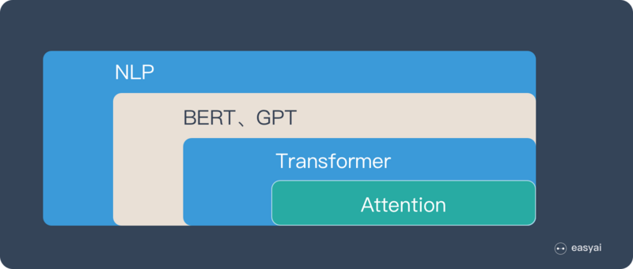

### Attention 的三大优点

之所以要引入 Attention 机制，主要是3个原因：

1. 参数少
2. 速度快
3. 效果好

#### 参数少

模型复杂度跟 CNN、RNN 相比，复杂度更小，参数也更少。所以对算力的要求也就更小。

#### 速度快

Attention 解决了 RNN 不能并行计算的问题。Attention机制每一步计算不依赖于上一步的计算结果，因此可以和CNN一样并行处理。

#### 效果好

在 Attention 机制引入之前，有一个问题大家一直很苦恼：长距离的信息会被弱化，就好像记忆能力弱的人，记不住过去的事情是一样的。

Attention 是挑重点，就算文本比较长，也能从中间抓住重点，不丢失重要的信息。下图红色的预期就是被挑出来的重点。

### Attention 的原理

下面的动图演示了attention 引入 Encoder-Decoder 框架下，完成机器翻译任务的大致流程。

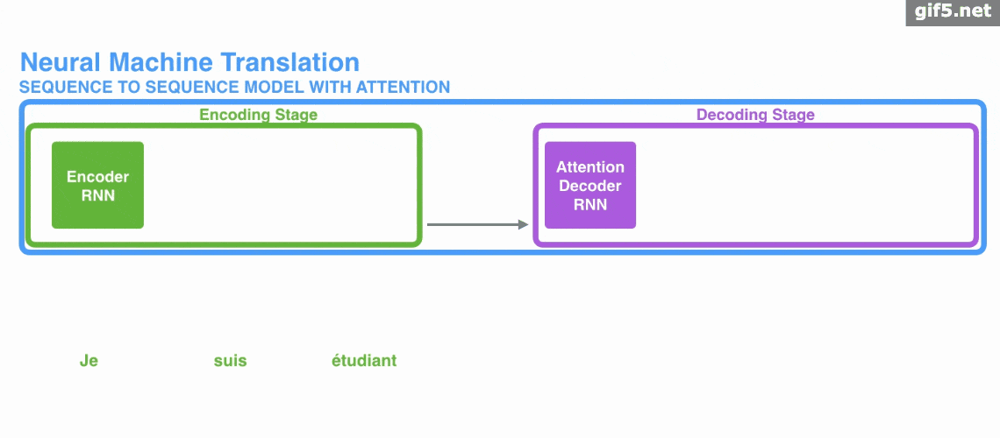

但是，Attention 并不一定要在 Encoder-Decoder 框架下使用的，他是可以脱离 Encoder-Decoder 框架的。

下面的图片则是脱离 Encoder-Decoder 框架后的原理图解。

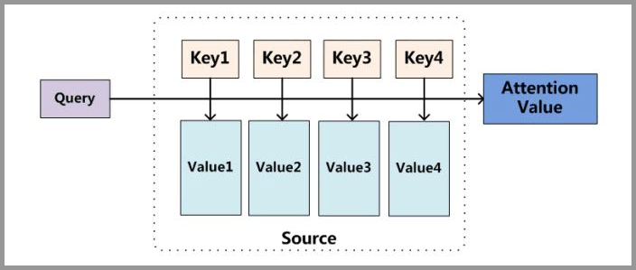

上面的图看起来比较抽象，下面用一个例子来解释 Attention 的原理：

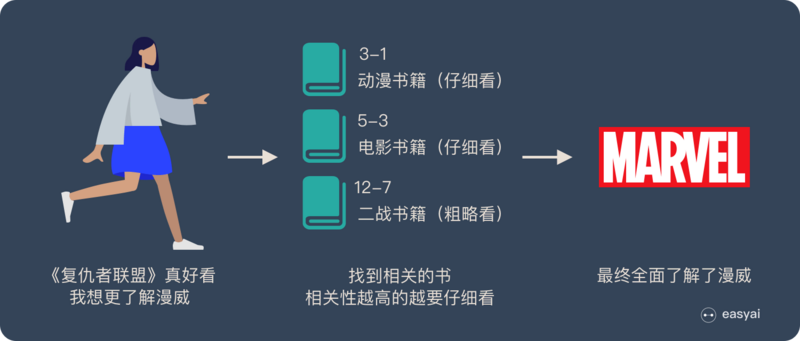

图书馆（Source）里有很多书（Value），为了方便查找，我们给书做了编号（Key）。当我们想要了解漫威（Query）的时候，我们就可以看看那些动漫、电影、甚至二战（美国队长）相关的书籍。

为了提高效率，并不是所有的书都会仔细看，针对漫威来说，动漫，电影相关的会看的仔细一些（权重高），但是二战的就只需要简单扫一下即可（权重低）。

当我们全部看完后就对漫威有一个全面的了解了。

Attention 原理的 3 步分解：

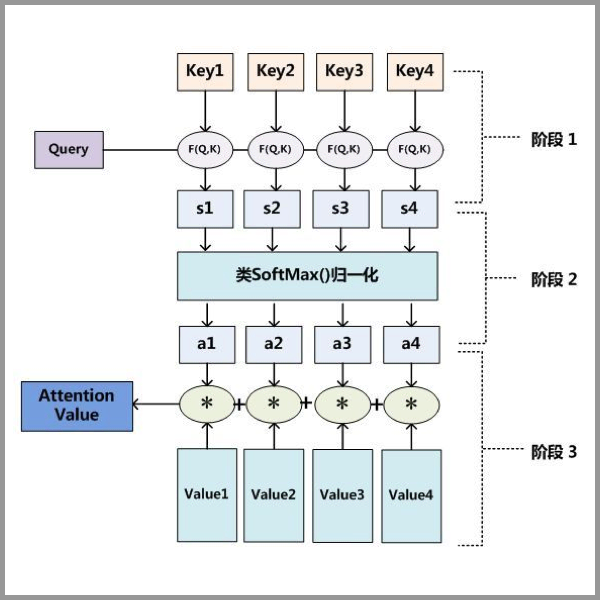

1. Query 和 Key 进行相似度计算，得到权值。
2. 将权值进行归一化，得到直接可用的权重。
3. 将权重和 Value 进行加权求和。

> 从上面的建模，我们可以大致感受到 Attention 的思路简单，四个字**带权求和**就可以高度概括，大道至简。做个不太恰当的类比，人类学习一门新语言基本经历四个阶段：死记硬背（通过阅读背诵学习语法练习语感）→ 提纲挈领（简单对话靠听懂句子中的关键词汇准确理解核心意思）→ 融会贯通（复杂对话懂得上下文指代、语言背后的联系，具备了举一反三的学习能力）→ 登峰造极（沉浸地大量练习）。这也如同 Attention 的发展脉络，RNN 时代是死记硬背的时期，Attention 的模型学会了提纲挈领，进化到 Transformer，融汇贯通，具备优秀的表达学习能力，再到 GPT、BERT，通过多任务大规模学习积累实战经验，战斗力爆棚。要回答为什么 Attention 这么优秀？是因为它让模型开窍了，懂得了提纲挈领，学会了融会贯通。—— 阿里技术 

### Attention 的 N 种类型

Attention 有很多种不同的类型：Soft Attention、Hard Attention、静态 Attention、动态 Attention、Self Attention 等等。下面就跟大家解释一下这些不同的 Attention 都有哪些差别。

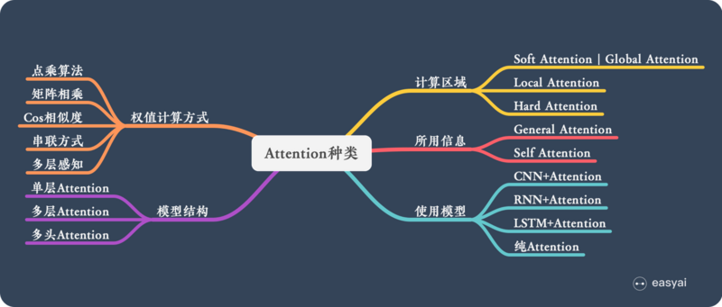

下面从计算区域、所用信息、结构层次和模型等方面对Attention的形式进行归类。

1. 计算区域
   
   根据 Attention 的计算区域，可以分成以下几种：
   1. Soft Attention，这是比较常见的 Attention 方式，对所有 Key 求权重概率，每个 Key 都有一个对应的权重，是一种全局的计算方式（也可以叫 Global Attention）。这种方式比较理性，参考了所有 Key 的内容，再进行加权。但是计算量可能会比较大一些。
   2. Hard Attention，这种方式是直接精准定位到某个 Key，其余 Key 就都不管了，相当于这个 Key 的概率是1，其余 Key 的概率全部是0。因此这种对齐方式要求很高，要求一步到位，如果没有正确对齐，会带来很大的影响。另一方面，因为不可导，一般需要用强化学习的方法进行训练，或者使用 Gumbel Softmax 之类的网络进行训练。
   3. Local Attention，这种方式其实是以上两种方式的一个折中，对一个窗口区域进行计算。先用 Hard 方式定位到某个地方，以这个点为中心可以得到一个窗口区域，在这个小区域内用 Soft 方式来算 Attention。

2. 所用信息

   假设我们要对一段原文计算 Attention，这里原文指的是我们要做 Attention 的文本，那么所用信息包括内部信息和外部信息，内部信息指的是原文本身的信息，而外部信息指的是除原文以外的额外信息。
   1. General Attention，这种方式利用到了外部信息，常用于需要构建两段文本关系的任务，Query 一般包含了额外信息，根据外部 Query 对原文进行对齐。
   2. Local Attention，这种方式只使用内部信息，Key 和 Value 以及 Query 只和输入原文有关，在Self Attention中，Key=Value=Query。既然没有外部信息，那么在原文中的每个词可以跟该句子中的所有词进行 Attention 计算，相当于寻找原文内部的关系。

3. 结构层次

   结构方面根据是否划分层次关系，分为单层 Attention，多层 Attention 和多头 Attention：
   1. 单层 Attention，这是比较普遍的做法，用一个 Query 对一段原文进行一次 Attention。
   2. 多层Attention，一般用于文本具有层次关系的模型，假设我们把一个 Document 划分成多个句子，在第一层，我们分别对每个句子使用 Attention 计算出一个句向量（也就是单层 Attention）；在第二层，我们对所有句向量再做 Attention 计算出一个文档向量（也是一个单层 Attention），最后再用这个文档向量去做任务。
   3. 多头 Attention，这是 Attention is All You Need 中提到的 Multi-head Attention，用到了多个 Query 对一段原文进行了多次 Attention，每个 Query 都关注到原文的不同部分，相当于重复做多次单层 Attention。

4. 模型方面

   从模型上看，Attention 一般用在 CNN 和 LSTM 上，也可以直接进行纯 Attention 计算。
   1. CNN+Attention
      
      CNN 的卷积操作可以提取重要特征，我觉得这也算是 Attention 的思想，但是 CNN 的卷积感受视野是局部的，需要通过叠加多层卷积区去扩大视野。另外，Max Pooling直接提取数值最大的特征，也像是 Hard Attention 的思想，直接选中某个特征。CNN 上加 Attention 可以加在这几方面：
      - 在卷积操作前做 Attention，比如 Attention-Based BCNN-1，这个任务是文本蕴含任务需要处理两段文本，同时对两段输入的序列向量进行 Attention，计算出特征向量，再拼接到原始向量中，作为卷积层的输入。
      - 在卷积操作后做 Attention，比如 Attention-Based BCNN-2，对两段文本的卷积层的输出做 Attention，作为 Pooling 层的输入。
      - 在 Pooling 层做 Attention，代替 Max pooling。比如 Attention pooling，首先我们用 LSTM 学到一个比较好的句向量，作为 Query，然后用 CNN 先学习到一个特征矩阵作为 Key，再用 Query 对 Key 产生权重，进行 Attention，得到最后的句向量。

   2. LSTM+Attention

      LSTM内部有Gate机制，其中input gate选择哪些当前信息进行输入，forget gate选择遗忘哪些过去信息，我觉得这算是一定程度的Attention了，而且号称可以解决长期依赖问题，实际上LSTM需要一步一步去捕捉序列信息，在长文本上的表现是会随着step增加而慢慢衰减，难以保留全部的有用信息。
      
      LSTM通常需要得到一个向量，再去做任务，常用方式有：
      - 直接使用最后的 hidden state（可能会损失一定的前文信息，难以表达全文）。
      - 对所有 step 下的 hidden state 进行等权平均（对所有 step 一视同仁）。
      - Attention机制，对所有 step 的 hidden state 进行加权，把注意力集中到整段文本中比较重要的 hidden state 信息。性能比前面两种要好一点，而方便可视化观察哪些 step 是重要的，但是要小心过拟合，而且也增加了计算量。

   3. Pure Attention

      Attention is all you need，没有用到 CNN/RNN，乍一听也是一股清流了，但是仔细一看，本质上还是一堆向量去计算 Attention。

5. 相似度计算方式

   在做 Attention 的时候，我们需要计算 Query 和某个 Key 的分数（相似度），常用方法有：
   1. 点乘
   2. 矩阵相乘
   3. Cos 相似度
   4. 串联方式
   5. 多层感知机

   