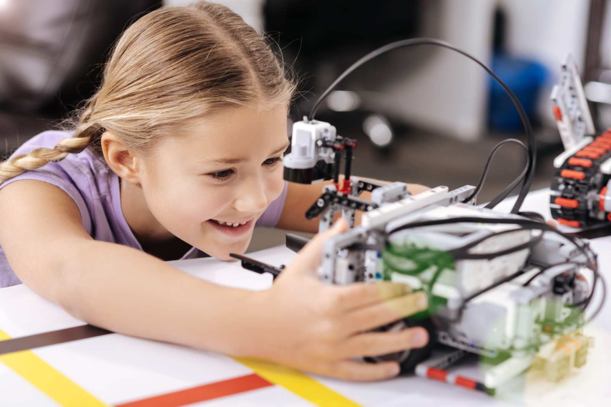
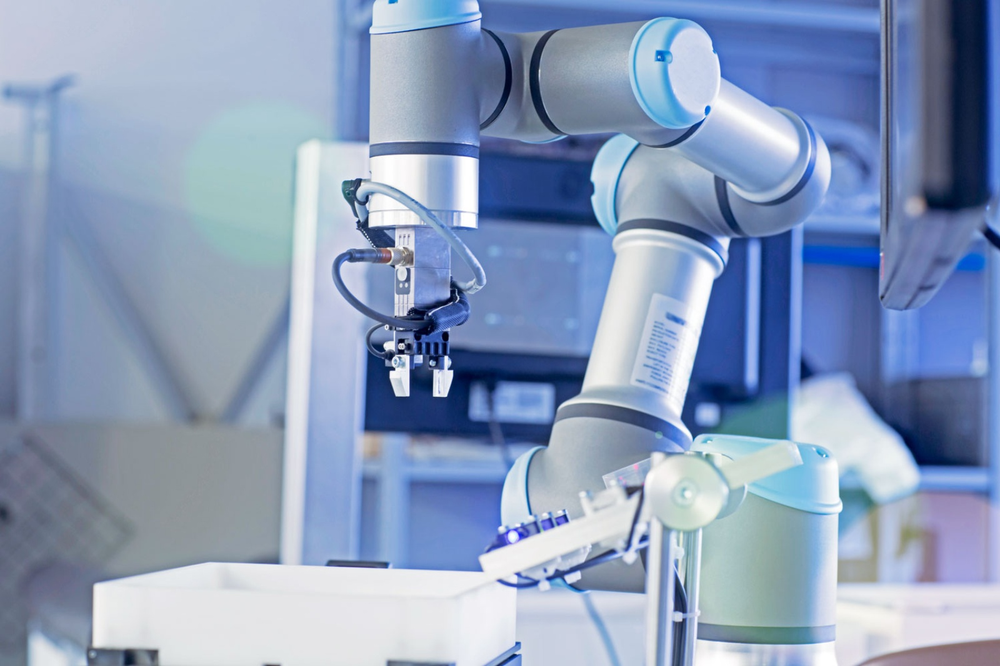
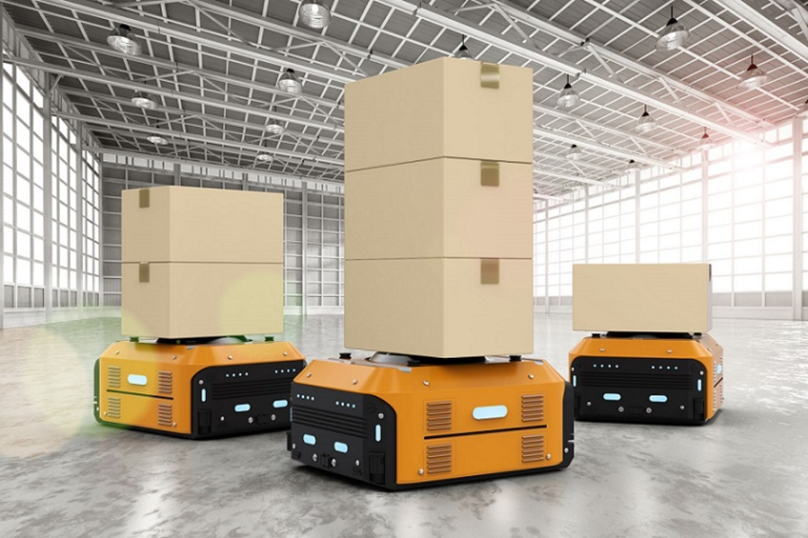
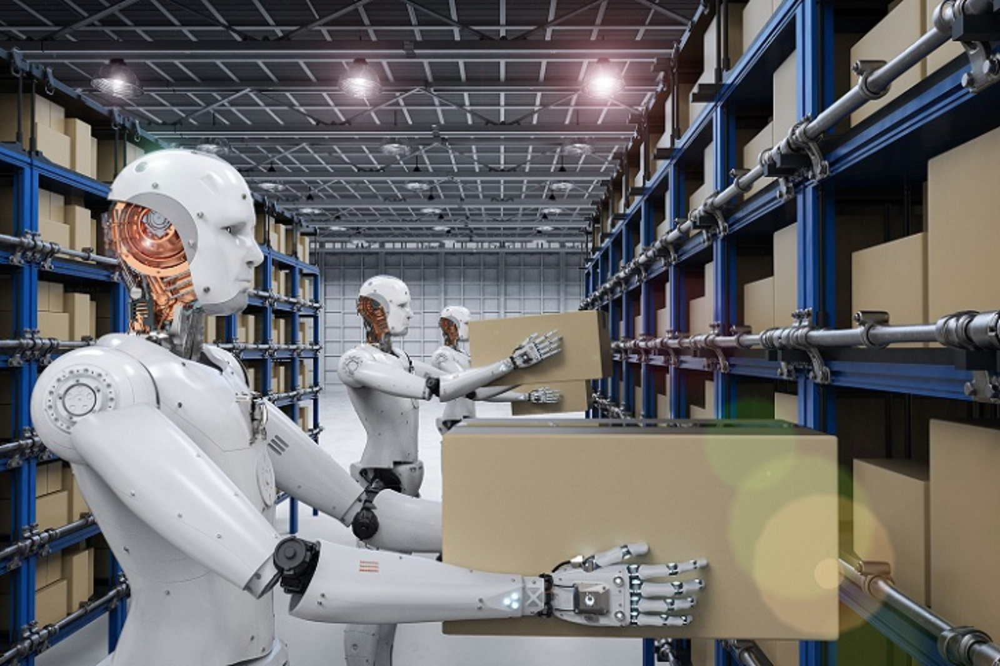
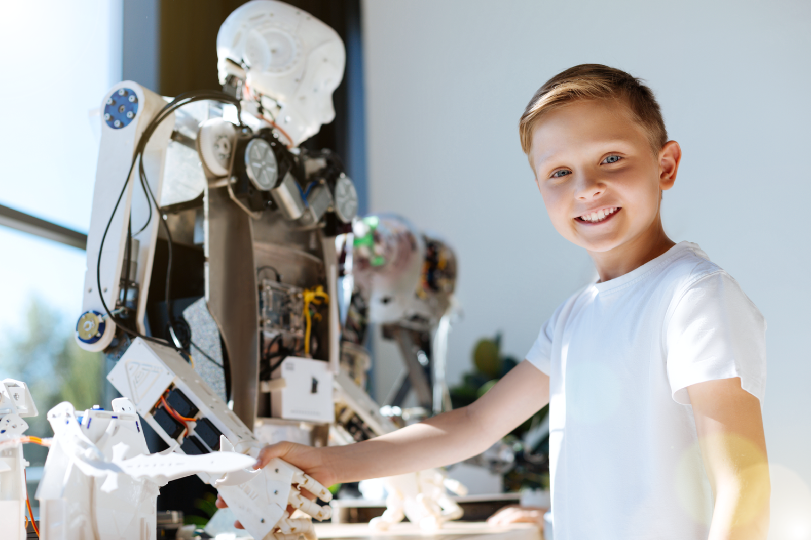
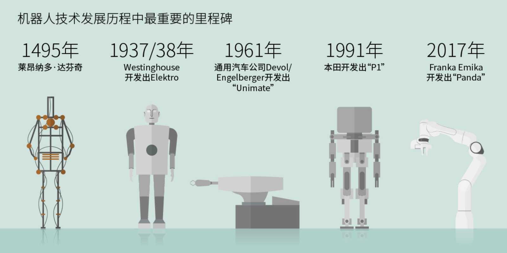
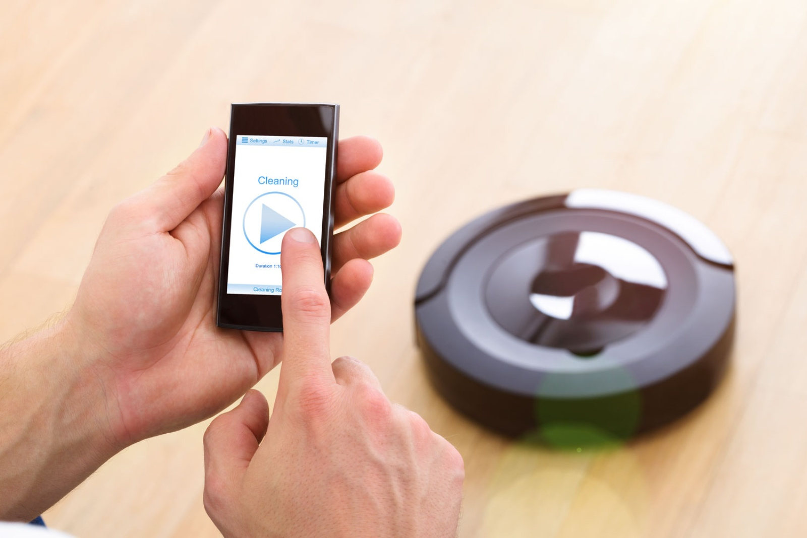
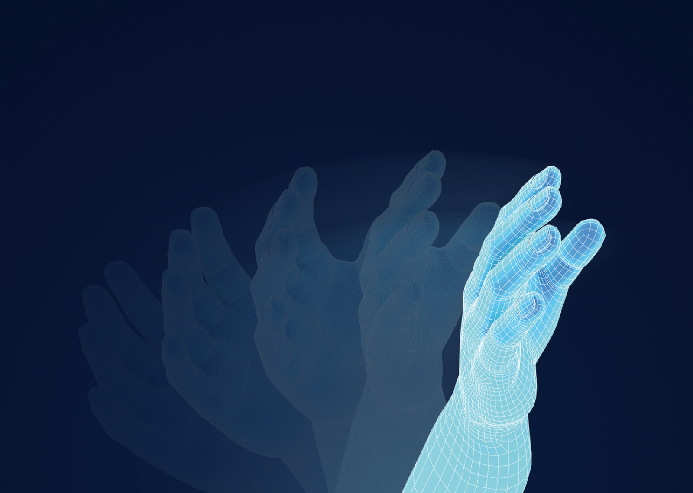
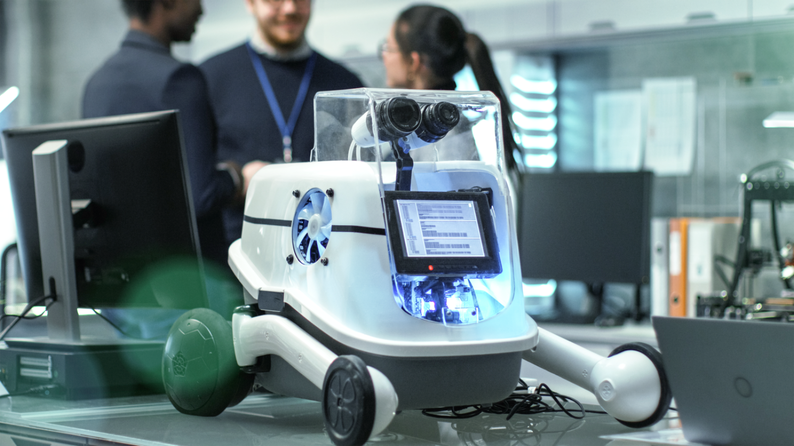
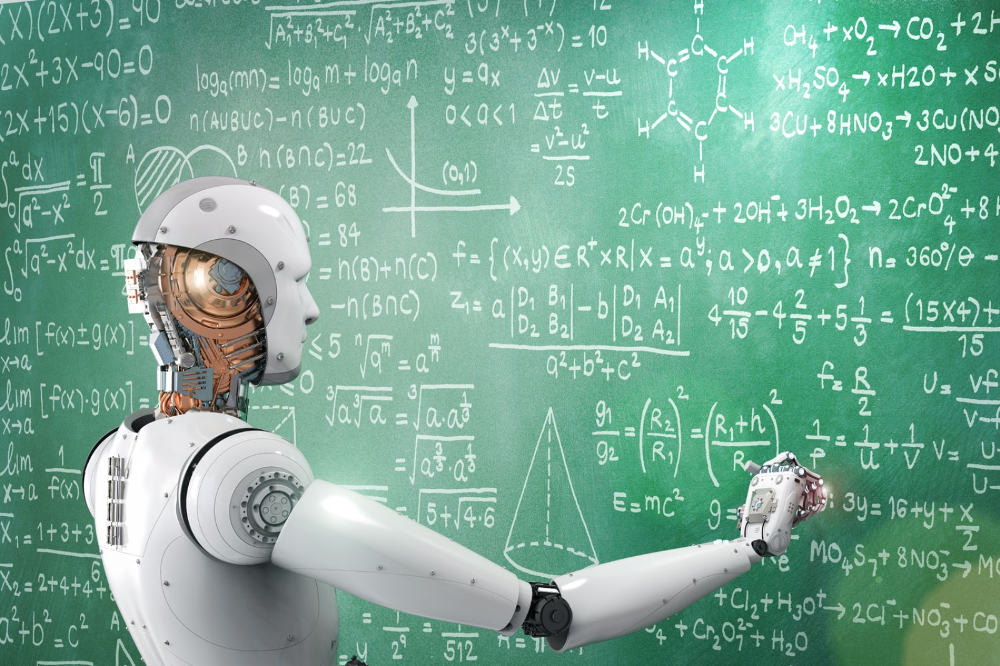

# 机器人

可控机器自古以来一直都让人类着迷。但机器人技术和机器人根源何在？ 过去有怎样的里程碑，将来如何呢？其最重要组成部分有哪些，工作原理是什么？什么是协作机器人和纳米机器人？机器人到底有多智能？它们是否能产生情感和学习社交行为？我们将讲解这项会从根本上改变人类未来的技术的最重要方面。

## 机器人的定义

机器人学是工程学与科学的子领域，其中包括机械工程、电气工程、计算机科学等。机器人学涉及机器人和计算机系统的设计、构造、操作和使用，以实现控制、传感反馈和信息处理。机器人是在传感器、执行器和信息处理的基础上实现与物理世界交互的装置。工业领域是机器人的一个关键应用领域，或者，确切来讲是工业4.0。

---

## 机器人的应用领域

### 协作机器人

协作机器人变得日趋重要。在工业领域有越来越多的方面，传统的工业机器人正在被协作机器人所取代或由协作机器人提供支持。协作机器人在生产过程中与人类一起工作，不再像典型的工业机器人那样与配备防护装置的人类同事分开。较之传统的工业机器人，协作机器人更小、使用更灵活，并且更易于编程。

协作机器人不会取代人类工作，而是作为补充。加拿大的 Paradigm Electronics 就是这样的例子：通过使用协作机器人，生产率提升50%，但工作岗位没有因此减少。工作人员在新创建的活动领域执行新任务，如为机器编程及在自动化生产过程结束时的质量控制等。波士顿咨询公司的专家认为，未来使用机器人将使员工的工作效率提高30％。

### 工业机器人

工业机器人是用于在工业环境中搬运、组装或加工工件的可编程机器。这些机器人大多由机械臂、抓手、各种传感器和控制单元组成。他们也可以根据自己的编程方式自动执行操作。过去几年里，全球机器人密度显著增加：2015年，平均每1万名员工有66台机器人，但现在已增至74台机器人。在欧洲，机器人平均密度为99，美国为84，亚洲为63。

根据2016年IFR（国际机器人联合会，所有国家机器人协会的国际联盟组织）的统计数据，美国安装有大约31500台机器人，创下工业机器人数量的历史新高，比2015年增长15％。2016年全球约有29万台工业机器人投入使用，比2015年增加了14%。未来将继续这一发展趋势：未来几年预计每年平均增长12％ 。

### 汽车行业的工业机器人

在这个面向机器人的关键行业中，50多年来机器在自动化生产过程中发挥了重要作用，使工作流程更高效、更安全、更快速且更灵活。 1961年，第一台工业机器人Unimate被引入通用汽车公司的生产过程。他们利用机器人来搬走注塑件。1973年，位于德国沃尔夫斯堡的大众汽车公司首次开始使用工业机器人。被人类同事称为“ Robby”的公司内部开发的机器人，在帕萨特的生产过程中投入使用。根据IFR的统计调查，2016年美国使用超过17600台工业机器人，比2015年增加43％。

### 自动导引车/AGV

自动导引车是一种无人驾驶运输车，配有自动控制和非接触导引的驱动系统。自动导引车通常用于运输在生产设施中使用的物料。在工业环境下，自动导引车代表的是从传统、笨重的传送带向节省空间、高度灵活的解决方案的发展。仓库是另一个受欢迎的使用自动导引车的场所，自动导引车会可个别商品或批量商品送到进行加工的指定包装场所。这种类型的机器人通常以大约每秒1-2米的速度移动，并能运输多达约2000公斤的重物。自动导引车在供电、任务执行及导航和路径规划方面有所不同。电能可通过电缆（用于轨道式自动导引车）、轨道或电池供应。电池通过感应充电板或在充电站充电，电池也可以更换。根据其任务及部署区域，用作叉车的自动导引车可以移动托盘，用作牵引车的自动导引车可以牵引拖车，或者可以运输箱子或包裹。譬如，自动导引车可以通过激光导航，在这种情况下，机器人会扫描特定位置上的标签，这样它们就能找到下一个目的地。另一种选择是通过识别颜色等方式进行光学导航。另外也利用天线或导轨来引导自动导引车。最灵活的装置是自主式AGV，可以扫描整个环境，并根据结果创建虚拟地图。它们能够将障碍通知其他AGV，并生成最佳运输路线。根据部署区域和所需的移动程度， AGV由一到四个主动驱动轮驱动。

### 服务机器人

服务机器人是为人类提供服务的机器。私人使用和专业应用有所不同。吸尘器和割草机机器人在私人领域的应用已发展成熟。以下是不同类型的服务机器人：

1. 家用机器人

   草坪修剪、吸尘或窗户清洁：机器人可以接管一些日常家务。人们对他们所节省的时间和工作量印象深刻：根据德国联邦信息技术协会Bitkom的一项研究，在参与调查的1000多人中，有42%可以设想自己家里有一台机器人。超过80％的人希望帮助完成吸尘或拖地，41％的人希望机器人能够在花园里帮忙。15%的受访者已经在家中安装了机器人。

2. 安全机器人

   尽管必须考虑数据保护和数据安全问题，但上述有代表性的Bitkom调查中有49％的参与者可以设想把自己家的安全托付给机器人。安全机器人在居民休假、出差或上班时照顾家庭。这些机器人可以通过互联网连接从一个app进行控制。如果机器人通过运动检测的方式检测到脉冲，就会向智能手机发送警报。集成摄像头可录制高清视频，并具有双向音频对讲功能。

3. 酒店业机器人

   韩国电子集团LG在拉斯维加斯的2018年消费电子展上展示了全新机器人产品系列CLOi。该服务机器人为顾客提供食物和饮料。它可以24小时使用（如在机场、火车站和酒店），并使用托盘提供餐食。 为客户提供服务后，机器人会返回服务站拿取新的零食，完成接下来的任务。

4. 农业机器人

   农业是另一个具有巨大机器人应用潜力的领域。目前，正在开展试点项目，在收割机上安装机械臂和多光谱摄像头，优化黄瓜采摘流程。播种时，从平板电脑控制的小型种植机器人不仅能播种，还会记录所有重要信息。无人机适用于监测蔬菜产品的成熟程度及杂草生长情况，如有必要，还可以向关键区域喷洒药剂。

5. 医疗机器人

   作为治疗辅助工具，机器人特别适用于患者必须学习如何在中风或神经系统疾病后重新激活自身运动系统的情况。瘫痪的人可以在训练机的帮助下再次学会走路，甚至爬楼梯。一个机器人可以完成两位治疗师的工作。在锻炼期间，患者也会收到直接反馈。借助可穿戴式机器人（体外骨骼），瘫痪的患者能够自行走路。机器人的步进运动由患者调整身体重心触发。

6. 手术机器人

   在手术室也能看到机器人的身影，它们并未取代外科医生，而是作为精确协助进行微创手术的助手提供帮助。外科医生不使用诸如剪刀或镊子之类的手术器械，而是利用操纵杆和脚踏板通过控制台来控制机器人。使用手术机器人进行手术可节省时间，对患者而言的侵入性也较低。最大限度降低人为错误导致的风险。

7. 玩具机器人

   索尼推出的机器狗Aibo是一款娱乐机器人，索尼于2006年停止销售，但在2017年以新版本重新推向市场。Aibo用两个摄像头和麦克风感知周围环境。获得的数据通过学习程序进行评估，这样机器狗就可以养成个性。除Aibo外，Roberta也属于玩具机器人类别。弗劳恩霍夫智能分析与信息系统研究所的这项活动，自2002年以来一直使用特殊机器人来鼓励孩子们采用有趣的方法学习技术，唤起他们对机器人开发和编程的兴趣。

### 类人机器人

类人机器人是指设计成看上去像人类的机器。关节位置和运动是受人类运动系统的启发而设计。类人机器人通常直立行走，这一点也很清楚。类人机器人领域的主要研发动力是人工智能（AI）。

### 人工智能

在大多数科学领域，类人机器人的发展被视为创造类似人类的人工智能的重要基础。而这是基于人工智能不能被编程而是由学习过程组成这样一个思路。因此，机器人只能通过积极参与社交生活来发展人工智能。不过，只有当机器人因其形状、移动性和传感器而被感知和接受为平等生物时，才有可能积极参与包括交流在内的社交生活。

### 人机交互

没有编程知识的人也可以与机器人进行交流，并以自然的方式向其提供指令和信息，人与机器之间通过语音、手势和面部表情进行的交互非常重要。

1. 语音识别                                                                                                                           

   即使在智能扬声器时代，实时识别和解读自然语言对于一台机器而言也是一个非常复杂的过程。这是由于存在可变因素，如周围的声音、背景噪音、音量、方言、口音或音高等。目前，机器可以识别自然语言，准确率达到95%。

2. 手势识别

   需要实时捕获3D数据来精确识别和解读人类手势，而不会延迟。 弗劳恩霍夫应用光学和精密工程研究所的科学家正在研究快速记录和处理3D数据的系统。两个高速摄像头和一个彩色摄像头记录图像，而特殊软件每秒将其转换为36条3D数据记录。 科学家们还为该系统开发了基于神经网络的学习软件。

3. 表情分析

   一般可以根据二人面部表情得出关于他们之间的对话如何进行的结论。这也将在人与机器人之间的对话中实施。由于采用了柔性聚合物和集成式伺服电机，Hanson Robotics生产的机器人的面部能够呈现出各种表情。 其目标是机器人将根据人类的面部表情调整其交互。譬如，表情焦虑，机器人应该与该人保持距离，表情有质疑，就应该提供信息。

4. 人工情感

   在正在进行的研究项目中，机器人正在被教导认识和理解人类情感，并作出相应的反应。通过相应的表情和手势，机器人可以显示或模拟情绪作为对人类的反应。其中一个例子是Emotisk培训系统，柏林洪堡大学的科学家目前正在与德国亚琛和科隆的大学医院合作开发该系统：该软件评估诸如视线和面部表情等信息，并给予人类相应的情感反馈。该系统旨在帮助自闭症患者识别他人的情绪，并通过发送非语言信号来做出反应。

5. 个体特征

   由于它们与人类的视觉相似性及其类人行为和活动，我们倾向于赋予类人机器人以个性。事实上，对个性的模拟会影响人机交互。在一项实验中，来自东洋理工大学的日本科学家研发出了一种机器人，它能追踪人类对话伙伴的眼睛，当他或她被其他事件分心时，就会进行记录。在这种情况下，机器人前倾，提高声音，然后点头。其结果是：通过展示个性特征，机器人重新获得了人类对话伙伴的注意力。

6. 社交智能

   在智能机器人与社交机器人之间划清界线仍然很困难，甚至是不可能的。目前的例子是Jibo，这是同名美国公司推出的第一款社交机器人，自2017年年底开始供货。根据制造商的说法，大约30厘米高的家庭机器人喜欢与人在一起，并与其建立关系。它会了解主人特别喜欢哪些人，并完美融入主人的社交生活。Jibo也很有魅力，能够通过诸如跳一段舞这种自发动作来制造惊喜。无论如何，这是制造商的一面之词。 现场试验表明，社交机器人与其他智能系统并无显著差异，但社交机器人要昂贵得多。

---

## 机器人的安全问题

机器人在不同生活领域的日益普及和传播以及人与机器之间的交互，为人类和数据的安全带来了机遇和挑战。在工作场所使用工业机器人和协作机器人的安全要求尤为显而易见。

### 对人类的保护

当机器人用于工业生产时，工作场所安全措施确保人类得到保护。 保护措施包括人与机器之间足够的安全距离、安全屏障、光电屏障以及扫描仪置于受监控区域内等。安全预防措施还包括机器人的紧急开关，以及识别物体与人的碰撞情况并做出适当响应的能力。 这尤其适用于协作机器人。

有了这些新的工业机器人，在某些工作区没有隔离安全装置，取而代之的是其他技术安全措施。譬如，如果一个人在几米之外，机器人就会以正常模式工作。如果这个人从一个确定的阈值靠近，机器人就会慢下来。如果这个人离得很近，只有一米的距离，机器人就会停止工作。

对于较新的系统，使用ToF（飞行时间）技术。该技术使用基于飞行时间测量距离的3D摄像头系统。周围环境被调制光源照亮。对于每个像素，摄像头都会测量光线到达物体并被反射所需的时间，然后用它来计算每个像素与所讨论物体的距离。雷达传感器也用于这一领域。在这种情况下，运动是在射频范围内电磁波的基础上检测到的。结合多种冗余技术，也可以加强人类的安全性。

### 数据保护

在连接越来越多的复杂系统并相互通信的工作场所，重要的是要保护这些系统免遭数据窃取和篡改。除篡改配置文件（更改运动区或位置数据）和代码篡改（对序列重新编程）外，篡改机器人反馈（停用警报）是最大的威胁。这些干预措施可能会导致产品遭到破坏，机器人受到损害，在最坏的情况下会导致在这些区域工作的人员受伤。为确保数据、接口和通信通道的安全，有越来越多的公司选择使用外部软件解决方案。这些解决方案通过对配置文件进行加密并将其存储在安全元件（SE）中来防止对配置文件的篡改。身份验证还可防止未经授权访问中央处理单元。为防止代码篡改，软件解决方案通过对代码的哈希处理和验证来提供对所发送命令的授权。

---

## 机器人的历史发展

对于机器人或机器人学，大家想象其历史可能只有50年左右。大多数人会用胳膊、腿和友好的笑容来想像一个或多或少看起来像人的机器。对类人机器和机械助手的痴迷已经存在了几个世纪。下面就是一些机器人演进过程中的亮点：

### 古代的Elon Musk

即使在公元前1世纪，也有一些发明、机器和作品可以被看作是我们今天所知道的机器人和机器人技术的前身。它们来自亚历山大港的希罗，也被称为亚历山大的赫伦，他是一位古希腊数学家和工程师。这也很好地解释了他的别称 Mechanicu。在他的《 Automata》（机器之书）中，主人公描述了各种各样的“机器人”。其中一些可以自动打开庙门或播放音乐。你几乎可以说，这是最早的古老的智能家居。除像弹弓一样的武器的草稿外，Mechanicus尤其为人所铭记的是他的汽转球，也被称为希罗的引擎。这是第一台热机，蒸汽机的前身。这位机器人学鼻祖设计了100多份机器人和机器草稿。

### 莱昂纳多和英勇的骑士

1495年，多才多艺的莱昂纳多·达芬奇设计出了可能是第一台类似人类的机器。 他的机械骑士能够坐下并站立，其他功能有：抬起遮阳板和双臂完全移动。这些动作是通过复杂的滑轮和电缆系统进行的。达芬奇是制造了机器人还是仅设计了机器人，已经无法通过历史证明。无论如何，根据图纸制造的机器人骑士完全发挥了作用。

### 机器人的反抗

机器人（robot）这个词在捷克作家 Karel Čapek 的1920年英语科幻剧R.U.R.中首次使用。第一次演出是在1921年1月25日。在国际上大获成功的这部科幻剧中，自动思考的机器和人类的形象是一样的。当他们产生意识时，机器人会反抗他们作为奴隶的角色，从而导致人类的灭绝。机器人是舞台上的终结者。

### Elektro

Elektro在1939年的纽约世博会上露面。 这个身高超过两米、体重120公斤的重型类人机器人能够借助于集成电唱机说出约700个单词。除具有活动的手臂和腿部外，这个机器人还能够区分不同颜色的灯光和抽雪茄。 在世博会结束后的一年，Elektro与机器狗Sparko一起亮相。

### 工业机器人革命

1961年，George Devol获得第一个工业机器人专利。同年，Unimate被部署在通用汽车的装配线上。它由一个电脑状盒子（连接到另一个盒子）和手臂组成。这个机器人从装配线上卸下重型压铸部件并将其焊接到汽车车身。这一生产环节会给人类雇员带来高健康风险。除化学物质引起的危险外，还有几起事故导致员工失去了肢体。在德国，工业机器人时代始于20世纪70年代。

### 屡获殊荣的多功能性

2017年11月，总部位于慕尼黑的初创公司Franka Emika因其开发廉价、灵活、直观操作的机器人而荣获德国总统颁发的2017德国未来奖。这种轻型机器人可以用于工业应用和医疗领域。这是由于在关节处安装了扭矩传感器，可以响应人类的触摸动作。这种机器人的另一个特点是价格远低于市场平均水平，因此，即使对中小型公司而言，这种高效的超现代化机器人也十分有吸引力并能负担得起。

---

## 机器人的驱动和控制

### 机器人的驱动

基本上有两种不同类型的机器人驱动：电机和液压驱动。这两种驱动的主要特点是什么？ 有哪些根本的区别？

1. 电机驱动

   许多现代机器人目前使用电机。虽然类人机器人和小型机器人主要由直流电机供电，但大多数工业机器人和数控机床都采用三相电机。这种电机在机器人经常进行相同运动的自动化系统中是首选，如旋转臂。

2. 液压驱动

   机器人中的现代液压驱动像人造肌肉一样工作。 自2014年以来，日本开发商一直在研究由橡胶软管、抗拉纤维和保护环组成的人造肌肉。这个模仿人体肌肉的系统不使用压缩空气，而采用液压驱动。这一概念的优点是：液压肌肉效率更高，也能完成精细动作。该系统比电机更坚固。配备液压驱动系统的机器人可以承受灾区的不利条件。

### 机器人的控制

机器人总是在三个阶段受到控制 —— 感知、处理和行动。

目前，大多数机器人类型都是由预编程算法或学习算法控制的。对于类人机器人和协作机器人而言，机器人通过传感器感知周围环境及其他重要信息，如识别工件。机器人处理这些信息，并作为信号将其传递给电机，电机使机械元件付诸行动。

人工智能（ AI）是机器人确定如何在环境中以最佳方式行动的另一种方式。在人机交互的范围内，可以将控制系统划分为不同的自动水平：

1. 直接控制

   通过这种控制，人类可以实现完全掌控。他们通过触摸直接控制、通过遥控或通过为控制单元编程的算法来控制机器人。

2. 监管控制

   人类指定基本的位置和动作序列。然后，机器人决定如何在规格范围内以最佳方式使用电机。

3. 半自主控制

   通过这些系统，人类指定完成一般任务。机器人自动确定最佳位置和运动序列来完成任务。

4. 自主控制

   机器人自动识别其任务，并自行完成。

---

## 机器人的抓手

机器人需要机械肢体来完成生产过程和移动物体。它们采用各种设计：

### 机械抓手

这种常用抓手主要用于工业机器人，大多数情况下，这种抓手配有一个气动或液压驱动系统。较小的机器人配有相应较小的抓手，装有一个气动驱动机构，能以合理成本实现精确动作。液压驱动系统用于重载任务。

### 磁性抓手

对于磁性抓手，永磁抓手和电磁抓手有所区别。使用更简单的永磁抓手，抓持力由永磁体提供。借助安装在永磁抓手内的活塞释放抓持的物料。电磁抓手由提供必要磁场的直流电供电。物料通过开关电源来抓放。

### 粘附式抓手

粘附式抓手用于拾取小物体，如罐和盒子。 粘附力是通过分子力在两种不同或相同物质的接触面上产生的吸力。这些物质可以处于固态或液态。机器人抓手利用液体的粘附力或通过使用特殊的粘合剂来移动物体。

### 真空抓手

真空抓手可以举起重物。利用周围空气的超压，物体被压在抓手吸盘的密封唇口上。工件或车窗等重物通过吸盘真空固定住。这些物体必须具有光滑表面，以便吸盘能将它们吸起来。

### 类人机器手

与传统的抓手相比，类人机器手可以执行更精细的动作。其中一个例子是圣保罗大学的Kanguera项目。这个机器人手是人手的形状和大小。信号通过电缆和变压器发送，相比以前的机器人手而言，能实现更高精度。

---

## 机器人的传感器

借助集成的传感器，机器人可以感知物理或化学影响并将其转化为脉冲。譬如，这使其可以识别物体并确定其位置。机器人还可以通过传感器识别环境中的其他重要因素，如温度、运动、压力、光线或湿度等。内部传感器提供有关速度或负载状态的信息；外部传感器特别有助于交互和导航。以下概述了最重要的传感器类型：

### 力/扭矩传感器

力/扭矩传感器是最常用的传感器类型之一。它们用在抓手中，可以记录力和扭矩。应变片能识别微米量级的变形。这些变形通过校准矩阵转化为三个力和力矩分量。力/扭矩传感器具有数字信号处理器，用于在变形情况下捕获和过滤传感器数据，计算测得的数据并通过通信接口发送

### 电感式传感器

电感式传感器也被称为接近式传感器。在不接触它们的情况下，它们会识别出在其测量范围内的金属部件。因此，电感式传感器非常适用于进行无磨损记录，如记录活动的机器部件的最终位置。传感器表面辐射出振荡的电磁场。如果金属物体在测量范围内，它们从振荡器中吸收少量的能量。如果能量传递达到阈值，则确认目标对象识别，传感器输出会改变其状态。

### 电容式传感器

电容传感器由彼此分离的两个金属部件组成，可以识别金属和非金属材料。通过电容器容量的变化实现非接触式测量。由于电容器的容量随其电极的距离而变化，因此这个可测量的变量用于测量距离。譬如，使用电容式传感器来可靠识别机器人附近的人。

### 磁性传感器

磁性传感器用于进行非接触式精确位置检测，甚至通过不锈钢、塑料和木制结构识别磁体。传感器基于GMR效应(巨磁电阻)。这种效应发生在由只有几纳米厚的交变磁和非磁性薄层组成的结构中。这种效应使该结构的电阻取决于磁性层磁化的相互取向。相反方向的磁化强度远大于相同方向的磁化强度。

### 触觉传感器

触觉传感器能感知物体的机械触摸，并获得随后发送的信号。譬如，一个抓手可以通过触觉传感器来确定一个物体的形状和位置。即使传感器还不能与人类感官相匹配，但创新的触觉传感器也能模仿人类指尖的机械特性和触觉感受器。这使得机器人可以根据物体状况自动调整抓握强度，尤其在人机交互中，这更是一个重要特性。

### 光学传感器

在机器人技术中，光学或视觉传感器的任务是从图像或图像序列中获取信息，分析这些信息，并在此分析的基础上采取行动或作出反应。譬如，数据由一个或多个摄像头（2D或3D）或通过扫描仪进行记录。光学传感器在机器人导航及其环境定位中起着重要作用。

---

## 机器人的运动

机器人从A到B有多种方式可行。最常见的是带轮子的机器人，因为它们易于控制并能以节能方式移动。不过，在许多情况下，其他移动方式更为合适，如在崎岖的地形或机器人必须在狭窄空间内移动时。机器人的自主运动在这个领域是一个很大的挑战。这意味着机器人自行决定哪种类型的运动最适合当前情况和环境。

### 滚动机器人

最常见的方法或运动方式是使用四个轮子。 但也有一两个轮子的机器人可以增加机动性并减少部件。全地形机器人有六个或更多的轮子。

### 轨道式机器人

农业中的喂食机器人就是这类运动的一个例子。饲料容器、搅拌装置和称重装置悬挂在轨道上或受到侧向引导。通过电池、拖曳电缆或供电导轨供电。机器人由安装在容器上的过程计算机控制。喂食机器人从固定储存或混合容器中获取新饲料。

### 步行机器人

直立行走的机器人对于开发者来说仍然是一个很大的挑战，特别是就稳定性而言。 ZOM（零力矩点）算法是来自本田的解决方案，ASIMO 机器人利用该解决方案实现直立行走。 但是，这个模型需要一个平坦的表面来移动。 因此，该机器人不适合在崎岖地形中行进。 更先进的方法是使用动态补偿算法。这种算法比ZMP技术更强大，因为机器人的运动一直受到监控，并且双脚的放置要确保稳定性。采用这种技术的机器人甚至可以跳跃。另一种方法是被动动力学，其中摆动肢体的动量被用于提高效率。通过这项技术，机器人甚至可以走上坡路，据说其运动比采用ZMP技术的机器人更高效，能达到它们的十倍。目前关于运动和平衡的最令人印象深刻的例子来自Boston Dynamics。

### 飞行机器人

如果我们想到飞行机器人，首先想到的就是无人机，现在无人机广泛用于民用和军事领域。但还有其他一些有趣的概念，比如欧盟的ARCAS（空中机器人协作装配系统）项目。德国航空航天中心的科学家们将一个机械臂组合在一架自主式直升机上。这个机器人用于检查和修理管道。其他可以想到的应用领域是维护卫星或工业设备，或在其他行星上建设基础设施。 2013年，哈佛大学的研究人员开发出可以飞行并潜入水中的机器人蜜蜂。展望未来，这些小型机器人将接管遭受灭绝威胁的蜜蜂的任务，为植物授粉。

### 自动导航机器人

移动机器人配备了导航软硬件组合，以感知周围环境，优化导航并响应动态事件，如人员或移动的物体。在大多数情况下，配合使用GPS导航设备、雷达传感器及激光雷达技术或摄像头，确保机器人可以在环境中安全导航和行动。

---

## 机器人的概述和展望

国际空间站的智能数字助理可以在未来的火星任务中减小人类承受的压力。借助阿凡达机器人，包括VR套装，每个人都可以造访世界上任何地方，而不必亲临现场。 一个四米高、三吨重的赛车手重新定义了赛车运动。毫无疑问：考虑到过去几年的快速发展，机器人将会产生持久的影响力，并将塑造人类的未来，以及它们与日益智能的自动机器的协作与共存。相关问题更多地与道德而不是技术有关。

但是人类应该做所有技术上可行的事情吗?机器应该变得有多智能?机器人是否应该变得如此智能，以至于在未来某个时候，他们将人类视为他们持续进步的障碍?当碰撞的发生不可避免时，无人驾驶车辆应如何反应：是否应该转向一群老年人而不是一群小学生？ 我们是否可以将我们的个性转到机器硬盘上，这样即使血肉之躯不在，我们也能继续存在下去？目前，这些考虑事项还有很长一段路要走。现在我们回到这里，概述机器人在我们生活不同领域的应用。
