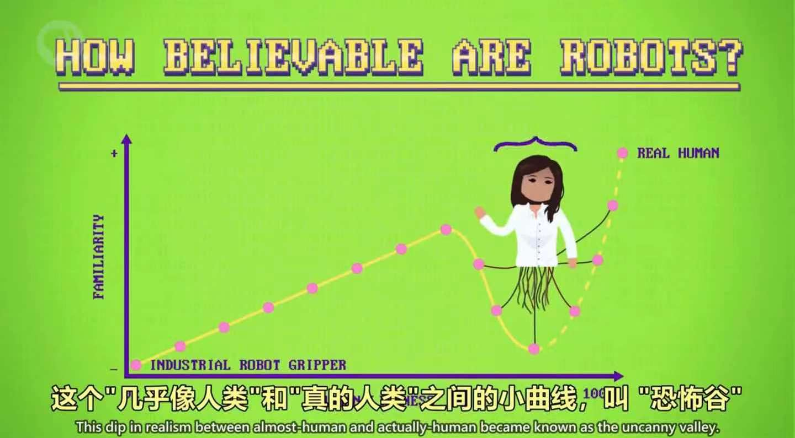

# 计算机心理学

## 计算机心理学

- 社会心理学
- 认知心理学
- 行为心理学
- 感知信息学

---

## 易用程度

指的是人造物体（比如软件），达到目的的效率有多高。

---

## 颜色排序

- 人类擅长给**颜色强度排序**，所以颜色强度很适合现实连续值。
- 而人类不擅长给**颜色排序**，所以如果数据没有顺序，用不同颜色就很合适，如分类数据。

---

## 信息分块

信息分块会更好记。分块是指把信息分成更小，更有意义的块，如电话号码分块，界面设计分块。

---

## 直观功能

直观功能为如何操作物体提供线索，如平板用于推，旋钮用来转，直观功能做得好，用户只需要看一眼就知道怎么搞，而不需要其他东西来说明。

eg: 门把手让人想拉开门，但如果门需要推开，那这就是个不好的直观功能，不如直接采用平板门来的好。

---

## 认出回想

和直观功能相关的一个心理学概念是认出和回想，这就是选择题比填空题简单的原因。一般来说，用感觉触发记忆会容易得多，比如文字、图片和声音，所以我们用图标表示功能，如垃圾桶表示回收站。

但是，让所有菜单选项好找好记，有时候意味着用的时候会慢一些。这与另一个心理学概念冲突："专业知识”，当你用界面熟悉之后，速度会更快一些，所以好的界面应该提供多种方法来实现目标。

eg: 复制粘贴，可以在"编辑"的下拉菜单中找到，也可以用快捷键，两者都不耽误，鱼与熊掌兼得。

---

## 机器情商

我们也希望电脑能有一点情商，能根据用户的状态做出合适地反应，让使用电脑更加愉快。

因为情绪会影响日常活动，比如学习，沟通和决策，情感系统会用传感器，录声音，录像（你的脸）以及生物指标，比如出汗和心率，得到的数据和计算模型结合使用，模型会估算用户的情绪，给最好的回应用户。

---

## 修正注视位

心理学研究也表明，如果想说服，讲课，或引起注意 ，眼神注视非常重要。

为此，研究人员开发了计算机视觉和图形软件来纠正头部和眼睛，看视频的人会觉得对方在直视他们。

---

## 似人属性

人也喜欢像人的机器人。

人机交互，简称HRI，是一个研究人类和计算机交互的领域。

但是，在像人类和真的人类之间，却存在着恐怖谷效应。

---

## 开放问题

计算机该不该对人类说谎等。
