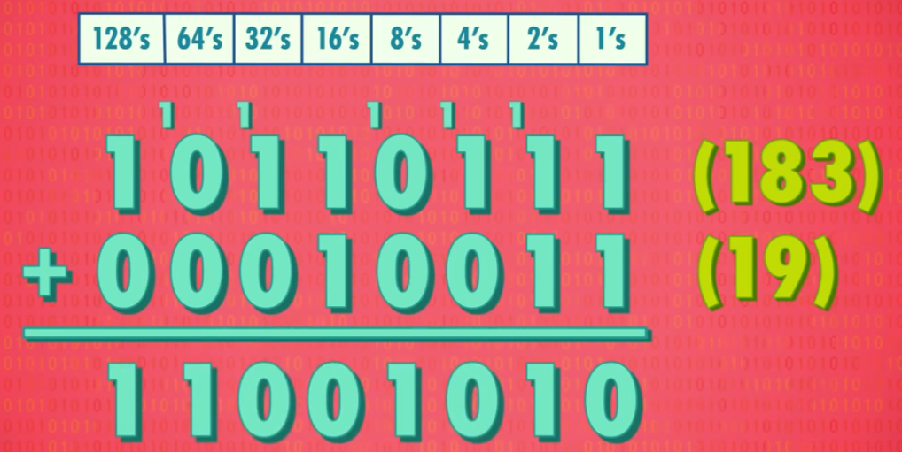

# 二进制

## 二进制的原理，存储单元 MB/GB/TB 解释

### 计算机中的二进制表示

单个数字 1 或 0，**1 位二进制数字命名为位(bit)，也称 1 比特。**

### 字节（byte）的概念

1byte=8bit，即 **1byte 代表 8 位数字**。最早期的电脑为八位的，即以八位为单位处理数据。为了方便，将八位数字命名为 1 字节（1byte）。

### 十进制与二进制的区别

- 十进制有 10 个数字，0-9，**逢 10 进 1**（不存在 10 这个数字），则每向左进一位，数字大 10 倍。
- 二进制有 2 个数字，0-1，**逢 2 进 1**,（不存在 2 这个数字），则每向左进一位，数字大 2 倍。

### 如何进行二进制与十进制联系起来

将十进制与二进制的位数提取出来，编上单位：
- eg. 二进制的 1011=1*2^0 + 1*2^1 + 0*2^2 + 1*2^3= 11（从右往左数）
- eg. 十进制的 1045= 1*10^3 + 0*10^2 + 4*10^1 + 5*10^0

### 十进制与二进制的图示

十进制的 263:

二进制的 10110111:

### 二进制的运算

相同的位数相加，逢 2 进 1

### 单位换算

数据存储以10进制表示：

- 1B（byte，字节）= 8 bit（见下文）；
- 1KB（Kilobyte，千字节）=1000B= 10^3 B；
- 1MB（Megabyte，兆字节，百万字节，简称“兆”）=1000KB= 10^6 B；
- 1GB（Gigabyte，吉字节，十亿字节，又称“千兆”）=1000MB= 10^9 B。

数据传输以2进制表示：

- 1B（byte，字节）= 8 bit（见下文）；
- 1KiB（Kibibyte，千字节）=1024B= 2^10 B；
- 1MiB（Mebibyte，兆字节，百万字节，简称“兆”）=1024KB= 2^20 B；
- 1GiB（Gibibyte，吉字节，十亿字节，又称“千兆”）=1024MB= 2^30 B。

### 32 位与 64 位电脑的区别

32 位能表示的数字：0 ~ 2的32次方-1，一共2的32次方个数

- 32 位的最大数为 43 亿左右 
- 64 位的最大数为 9.2*10^18

---

## 正数、负数、整数、浮点数的表示

### 整数（Integer Numbers）

表示方法:

- 第 1 位：表示正负(1 是负，0 是正)
- 其余 31 位/63 位： 表示实数

### 浮点数（Floating Point Numbers）

定义：小数点可在数字间浮动的数（非整数）

表示方法：IEEE 754 标准下

用类似科学计数法的方式，存储十进制数值

- 浮点数=有效位数*指数
- 32 位数字中：第 1 位表示正负，第 2-9 位存指数。剩下 23 位存有效位数

eg. 625.9=0.6259（有效位数）*10^3（指数）

---

## 美国信息交换标准代码 - ASCⅡ

1. 全称：美国信息交换标准代码。
2. 作用：用数字给英文字母及符号编号。
3. 内容：7 位代码，可存放 128 个不同的值。
4. 图示：

   

---

## 统一所有字符编码的标准 - UNICODE

1. 诞生背景：1992 诞生，随着计算机在亚洲兴起，需要解决 ASCⅡ不够表达所有语言的问题。
为提高代码的互用性，而诞生的编码标准。
2. 内容：UNICODE 为 17 组的 16 位数字，有超过 100 万个位置，可满足所有语言的字符需求。
