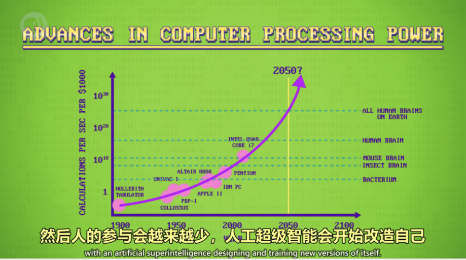

# 奇点与未来

## 普适计算（Ubiquitous Computing）

普适计算又称普存计算、普及计算、遍布式计算、泛在计算，是软件工程和计算机科学中的一个概念，其中的“计算”可以随时随地执行。与桌面计算相比，普适计算可以使用任何设备、在任何地理位置和任何格式进行。当用户进行人机交互的时候，该计算机可以以各种形式存在，包括冰箱、平板电脑和终端机，甚至是一副眼镜。支持普适计算的基础技术包括互联网、高级中间件、操作系统、传感器、微处理器、新I/O和用户界面、网络、移动协议以及新资料。

普适计算是一个涉及研究范围很广的课题，包括分布式计算、移动计算、人工智能、嵌入式系统、感知网络以及信息融合等多方面技术的融合。

---

## 技术奇点（Technological Singularity）

根据技术发展史总结出的观点，认为人类正在接近一个使得现有技术被完全抛弃或者人类文明被完全颠覆的事件点，在这个事件点以后的事件就像黑洞的事件视界一样完全无法预测。例如，意识上传技术可能使人类的意识摆脱有机体的约束，在这个奇点之后的人类文明将发展到当今完全无法理解的水准。

一般设想技术奇点将由超越现今人类并且可以自我进化的机器智能、或者其它形式的超级智能的出现所引发。由于其智能远超今天的人类，因此技术的发展会完全超乎全人类的理解能力，甚至无法预测其发生。

之所以被称为奇点，因为它是一个临界点。当我们越来越接近这个临界点，它会对人类的事物产生越来越大的影响，直到它成为人类的共识。但当它最终来临的时候，也许仍会出人意料并且难以想象。就好比物理学上引力无穷大时产生的黑洞的物理属性一样，已经不在一般正常模型所能预测的范围之内。

---

## 探索未来

我们人类是这个地球上，唯一拥有着高级智慧的生物。而且不仅是在这个地球上，在整个太阳系中，都是唯一拥有高级智慧的生命。所以我们人类自然而然的成为了，现在这个地球上的主宰者。但是我们人类还只出现了300万年，而人类文明的建立和发展，就只有8000年而已。不过就在这几千年里，我们人类的文明和科学技术，已经达到了一个可以探索宇宙的程度了。

早在四十九年之前，我们人类就可以将人类送上月球，然后安全的返回地球了。不过这种程度，在这个浩瀚无垠的宇宙中，是不算什么的。我们人类能够如此快速的登上月球，主要是因为月球离我们地球十分的近。所以到现在为止，我们人类还是只能够登上月球而已。就算是离我们地球十分近的火星，我们人类想要去到上面，都需要七个月的时间。而且火星上的环境十分的恶劣，我们人类是难以在上面进行长时间的研究的。

所以我们人类到现在为止，还只能发射一些探测器上去。不过这样给我们人类提供了一个新的方向，那就是让智能机器人上去探索。因为机器人相比起我们人类这种血肉之躯来说，它们的钢铁之躯，是不会受到太多的制约的。尤其是现在我们人类的智能机器人技术，也发展到一定的程度了。有一些智能机器人的动作，可以和我们人类的动作相媲美了。所以要是我们人类想要去探索，或是改造一些星球。我们就可以根据那个星球上的环境，而制定出对应的机器人，然后在上面进行改造。这样我们人类就可以不用再亲力亲为了，还能减少很多的伤害。

不过要是我们人类未来制造的机器人太智能了，甚至是拥有自己的意识了。那么它们极有可能在别的星球上，形成一个机器人种族。自己挖掘资源，自己造自己。说不定在我们地球的周围，就有很多的这种从其他更高级文明，流放出来的机器人星球。只是它们住在地下，我们人类难以发现。说不定这些机器人的智商，比我们人类还要高。不不过这些都只是猜测，但是机器人代替人类探索宇宙，是一种可预见的未来。
