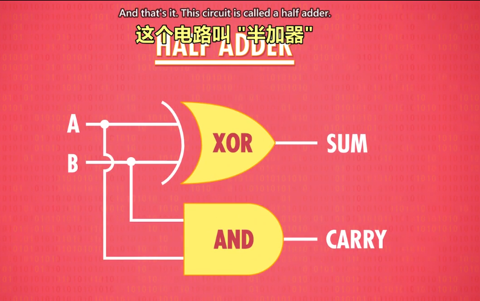
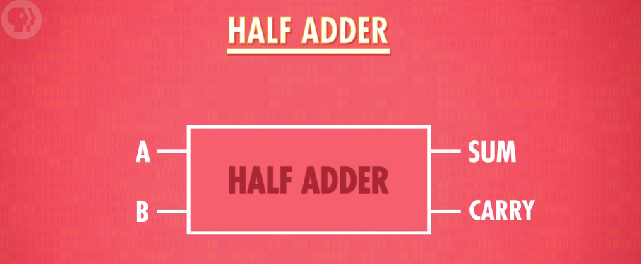
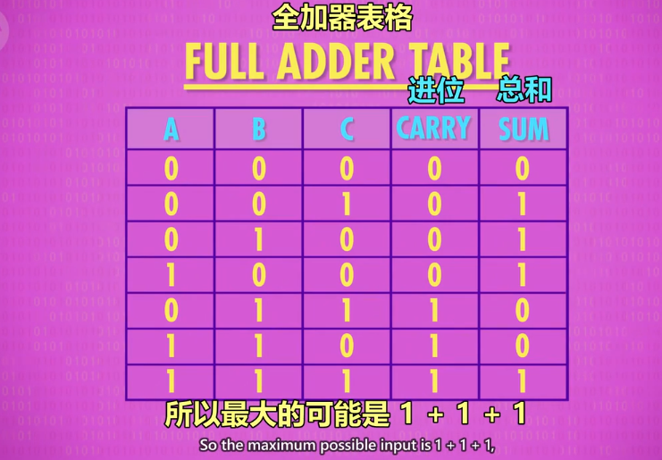
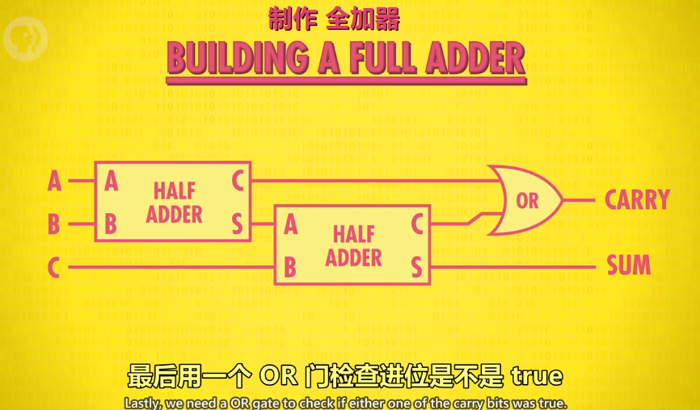
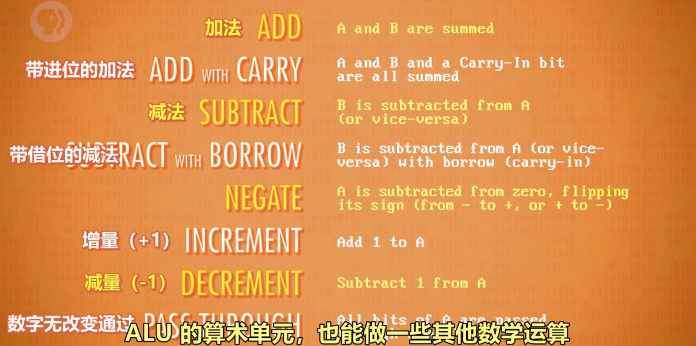
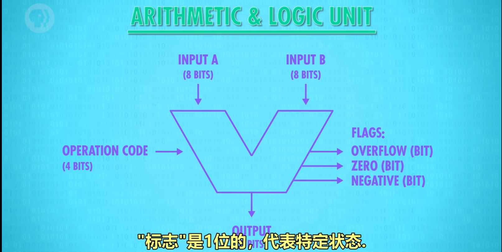

# 算术逻辑单元

## 什么是算术逻辑单元

1. 命名：简称 **ALU**，**A**rithmetic & **L**ogic Unit
2. 组成：ALU 有 2 个单元，**1 个算术单元和 1 个逻辑单元**（Arithmetic Unit 和 Logic Unit）
3. 作用：计算机中负责运算的组件，**处理数字/逻辑运算的最基本单元**。

---

## 算术单元

1. 基本组件：
   - 由半加器、全加器组成
     - 半加器、全加器由 AND、OR、NOT、XOR 门组成

2. 加法运算

   1. 组件：AND、OR、NOT、XOR 门
   2. 元素：输入 A，输入 B，输出（均为 1 个 bit，即 0 或 1）
   3. 半加器：
      - 作用：用于计算个位的数字加减。
        - 输入：A，B
        - 输出：总和，进位
        
        
      - 抽象：
        
        备注：sum:总和 carry：进位
   4. 全加器：
      - 作用：用于计算超过 1 位的加法（ex：1+1+1），由于涉及进位，因此有 3 个输入（C 充当进位）。
        
      - 原理图示：
        
      
3. 如何用半加器与全加器做 8 位数的加法

   说明：以 8 位行波加法器为例
   1. 用半加器处理第 1 位数（个位）的加法，得到的和为结果的第 1 位。
   2. 将输出的进位，输入到第 2 位用的全加器的输入 C 中。
   3. 将第 2 位的 2 个数用全加器计算，得到的和为结果的第 2 位（sum）。
   4. 将第 2 位计算的进位连接到百位的全加器输入 C 中。
   5. 在第 3-8 位上，循环第 3-4 步的操作。
   
   
   备注：现在电脑使用的加法器叫“超前进位加法器”

4. 算术单元支持的其他运算
   
   

---

## 溢出的概念

1. 内容：在有限的空间内，无法存储位数过大的数，则称为溢出。
2. 说明：第 8 位的进位如果为 1，则无法存储，此时容易引发错误，所以应该尽量避免溢出。

---

## 逻辑单元

1. 作用：执行逻辑操作，如 NOT、AND、OR 等操作，以及做简单的数值测试。

---

## ALU 的抽象

1. 作用：ALU 的抽象让工程师不再考虑逻辑门层面的组成，简化工作。
2. 图示：
   
3. 说明：
   - 输入 A，B
   - 输出
   - 标志：溢出、零、负数

   
