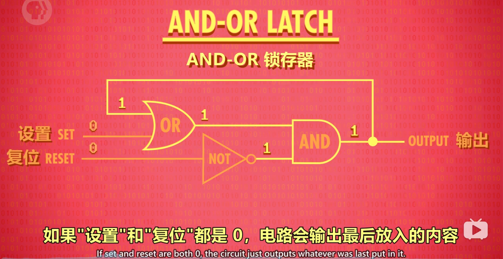
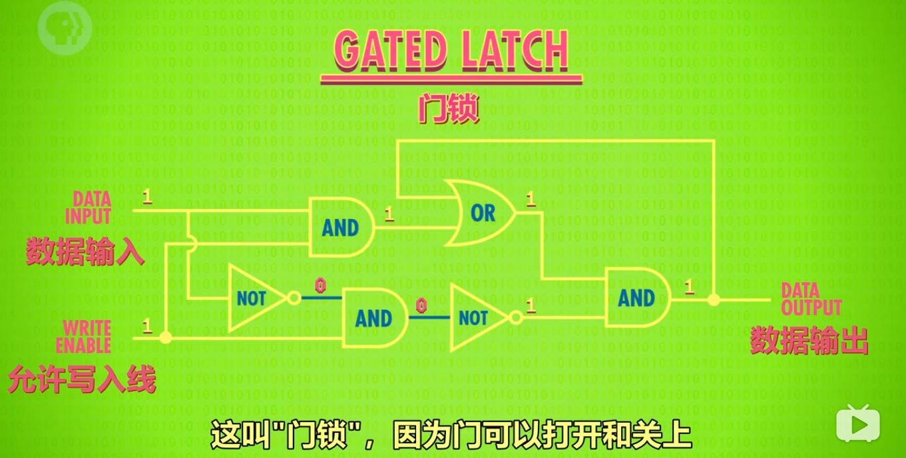
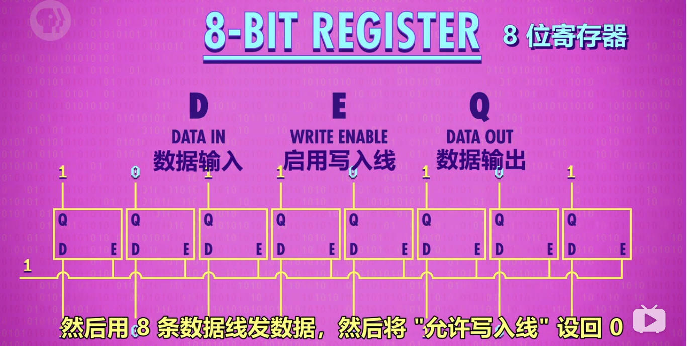
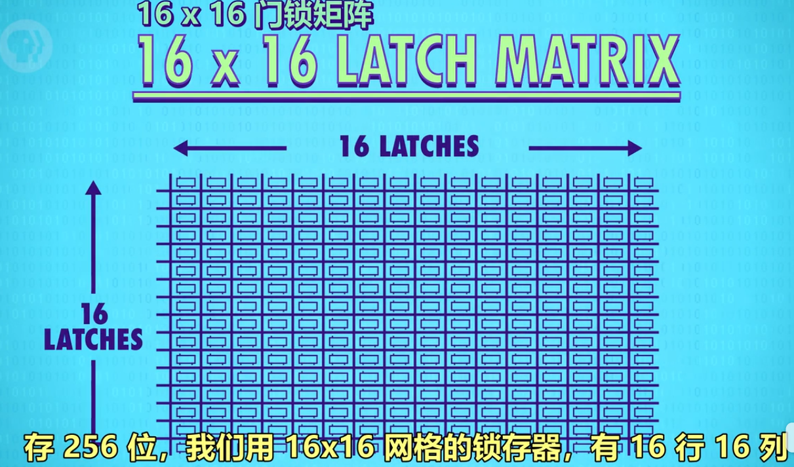
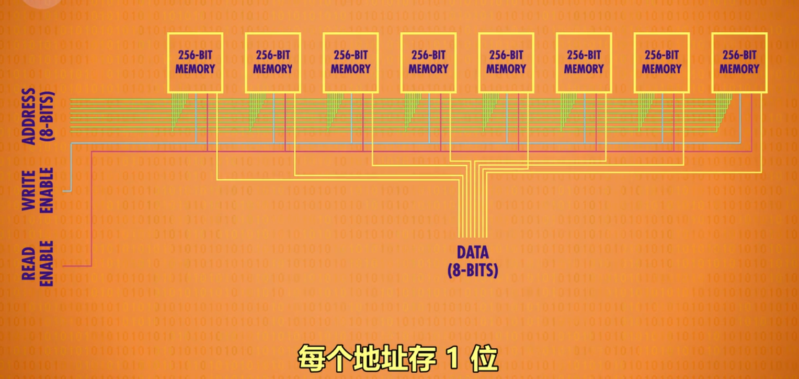
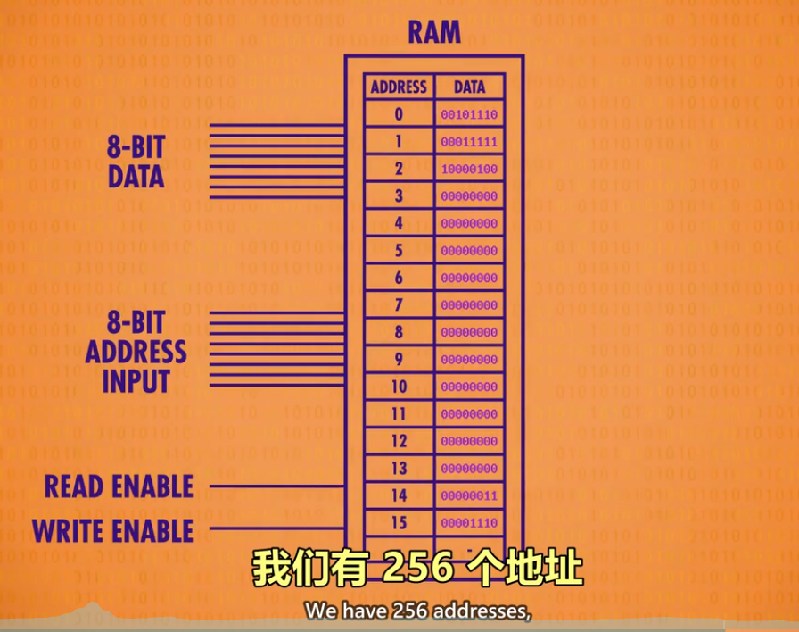

# 寄存器与内存

## 课程导入

当玩游戏、写文档时如果断电，进度会丢失，这是为什么？

- 原因是这是电脑使用的是 RAM（随机存取存储器），俗称内存，内存只能在通电情况下存储数据。
- 本节课程将讲述内存的工作原理。

---

## 概念梳理

1. 锁存器：锁存器是利用 AND、OR、NOT 逻辑门，实现存储 1 位数字的器件。
2. 寄存器：1 组并排的锁存器
3. 矩阵：以矩阵的方式来存放锁存器的组合件，n*n 门锁矩阵可存放 n^2 个锁存器，但同一时间只能写入/读取 1 个数字。（早期为 16*16 矩阵）
4. 位址：锁存器在矩阵中的行数与列数。 eg. 12 行 8 列
5. 多路复用器：一组电线，输入 2 进制的行址&列址，可启用矩阵中某个锁存器
6. 内存（RAM）：随机存取存储器，由一系列矩阵以及电路组成的器件，可根据地址来写入、读取数据。类似于人类的短期记忆，记录当前在做什么事情。

---

## 锁存器

1. 作用：存储 1 位数字。
2. 图示：
   
   
3. 门锁:
   - 锁存器需要同时输入 2 个数字，不太方便。
   - 为了使用更方便，只用 1 根电线控制数据输入，发展了门锁这个器件。另外，用另一根电线来控制整个结构的开关。（和复位作用不同）
   
   

---

## 寄存器

1. 作用：并排使用门锁，存储多位数字
2. 图示：
   

---

## 门锁矩阵

1. 作用：
   - n*n 的矩阵有 n^2 个位址，则可以存储 n^2 个数。但 1 个矩阵只可记录 1 位数字，n 个矩阵组合在一起，才可记录 n 位数。如 1 个 8 位数，会按位数分成 8 个数，分别存储在 8 个矩阵的同一个位址中。
   - 8 个矩阵，则可以记录 256 个 8 位数字。
2. 通俗理解：
   - 16*16 的门锁矩阵，可理解为 1 个公寓，1 个公寓 256 个房间。
   - 8 个门锁矩阵并排放，则有了 8 个公寓。
   - 规定每一个公寓同一个编号的房间，都有一样的标记（地址），共同组成 8 位数字。
   - 那么 8 个公寓就能存 （8*256 / 8）个数字。
3. 原因：
   - 16*16 的门锁矩阵虽然有 256 个位置，但每次只能存/取其中 1 个位置的数字。
   - 要表示 8 位数字，就需要同时调用 8 个门锁矩阵。
4. 图示：
   
   
5. 地址多路复用：
   - 使用方法：在多路复用器中输入位址，x 行 x 列（2 进制），即可点亮 x 行 x 列的锁存器。
   - 举例：
   
     |二维索引|矩阵1|矩阵2|矩阵3|矩阵4|矩阵5|矩阵6|矩阵7|矩阵8|
     |:---:|:---:|:---:|:---:|:---:|:---:|:---:|:---:|:---:|
     |1 行 5 列|1|0|1|1|0|0|1|0|
     |2 行 3 列|0|1|0|0|1|1|0|1|

---

## 内存

1. 粗略定义：将一堆独立的存储模块和电路看做 1 个单元，组成内存方块，n 个内存方块组成内存模块。在一个电路板上所有的内存方块统称为内存(RAM)。
2. 图示：
   
