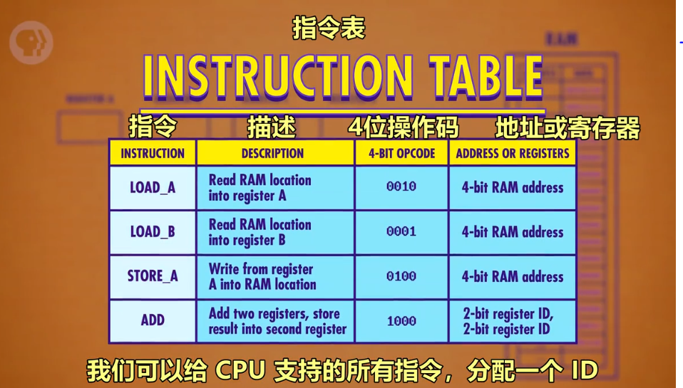
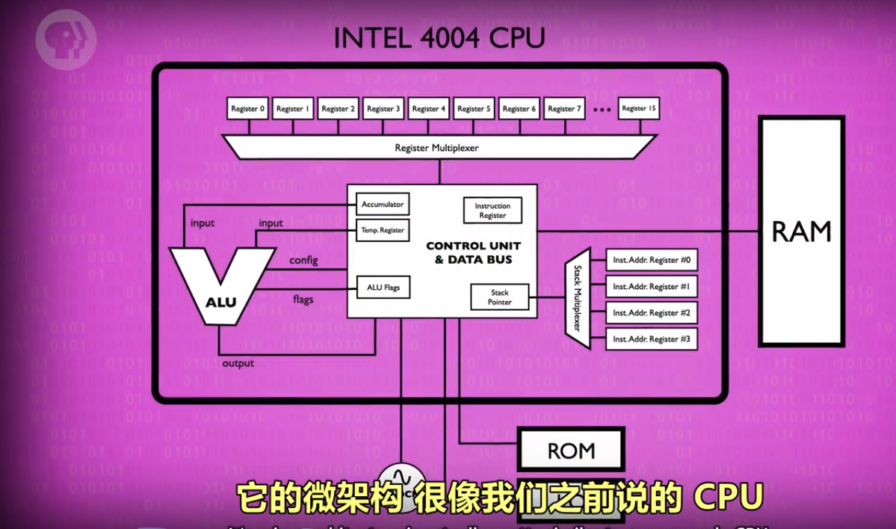

# 中央处理器

## 概念梳理

- **CPU（Central Processing Unit）**：中央处理单元，负责执行程序。通常由寄存器/控制单元/ALU/时钟组成。与 RAM 配合，执行计算机程序。CPU 和 RAM 之间用“地址线”、“数据线”和“允许读/写线”进行通信。
  - **指令**：指示计算机要做什么，多条指令共同组成程序。如数学指令，内存指令。
- **时钟**：负责管理 CPU 运行的节奏，以精确地间隔，触发电信号，控制单元用这个信号，推动 CPU 的内部操作。
  - **时钟速度**：CPU 执行“取指令→解码→执行”中每一步的速度叫做“时钟速度”，单位赫兹Hz，表示频率。
  - **超频/降频**：
    - 超频，修改时钟速度，加快 CPU 的速度，超频过多会让 CPU 过热或产生乱码。
    - 降频，降低时钟速度，达到省电的效果，对笔记本/手机很重要。
- **微体系框架**：以高层次视角看计算机，如当我们用一条线链接 2 个组件时，这条线只是所有必须线路的抽象。

---

## CPU 工作原理

### 必要组件

- 指令表：给 CPU 支持的所有指令分配 ID
- 控制单元：像指挥部，有序的控制指令的读取、运行与写入。
  - 指令地址寄存器：类似于银行取号。该器件只按顺序通报地址，让 RAM 按顺序将指令交给指令寄存器。
  - 指令寄存器：存储具体的指令代码。

### 过程

1. **取指令**：指令地址寄存器发地址给 RAM → RAM发该地址内的数据给指令寄存器 → 指令寄存器接受数据
2. **解码**：指令寄存器根据数据发送指令给控制单元 → 控制单元解码（逻辑门确认操作码）
3. **执行阶段**：控制单元执行指令(→ 涉及计算时 → 调用所需寄存器 → 传输入&操作码给ALU执行）→ 调用RAM特定地址的数据 → RAM将结果传入寄存器 → 指令地址寄存器+1

### 图示

