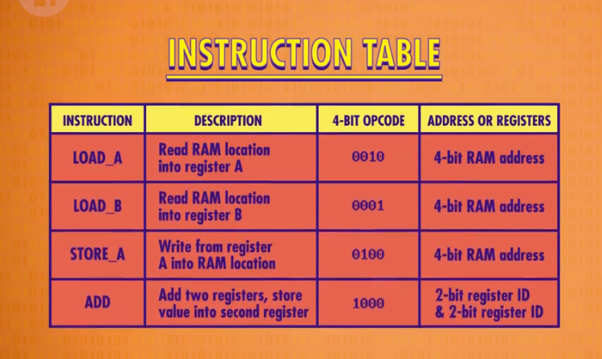
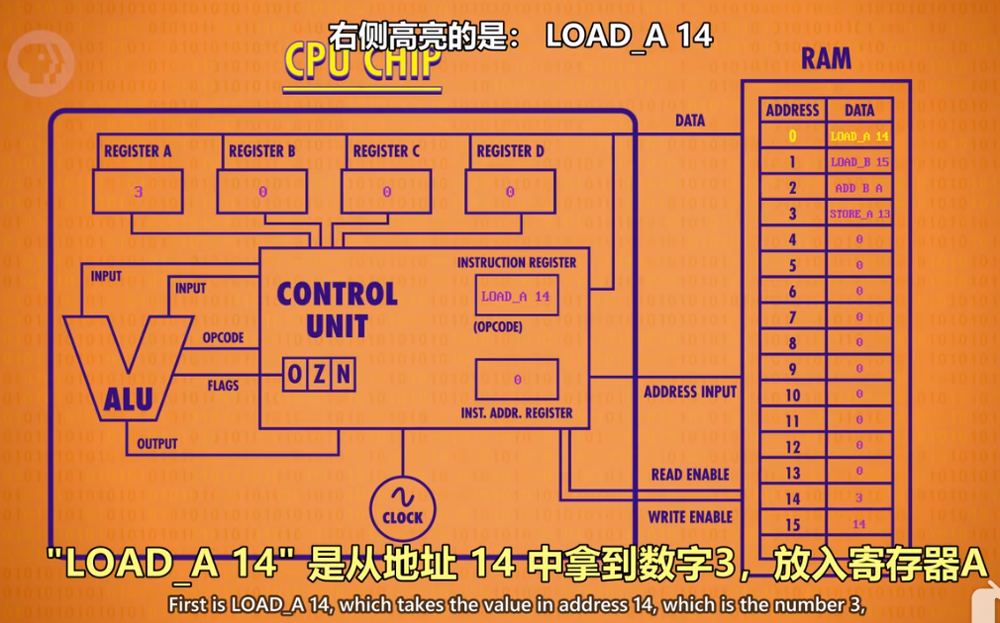

# 指令和程序

## 概念梳理

- 指令：指示计算机要做什么的代码（机器码），多条指令共同组成程序。如数学指令，内存指令。（注:指令和数据都是存在同一个内存里的。）
- 指令集：记录指令名称、用法、操作码以及所需 RAM 地址位数的表格。

---

## 指令执行

- 原则：
  - RAM 每一个地址中，都存放 0 或 1 个数据。
  - 特定的数字组合，就表示为一个指令，否则表示一个值。
- LOAD 指令：
  - 计算机会按地址的顺序，读取 RAM 中所记录的指令/数据。
  - 计算机接受到指令后，如 LOAD_A，则通过数据线将数据传至寄存器 A。
  
  
- ADD 指令：
  - ADD B A 指令告诉 ALU，把寄存器 B 和寄存器中的数字加起来，存到寄存器 A 中。
- JUMP 指令：
  - 遇到 JUMP 指令，程序会跳转至对应的 RAM 地址读取数据。
  - JUMP 指令可以有条件跳转（如 JUMP-negative），也可以无条件跳转。

---

## 计算机指令长度

由于早期计算机每个字只有 8 位，指令只占 4 位，意味着只能有 16 个指令，这远远不够。

现代计算机有两种方式解决指令不够用的问题：

- 最直接的是用更多位来表示指令，如 32 位或 64 位。
- 采用“可变指令长度”，令不同的指令的长度不同，尽量节约位数。
  - 假设 1 个字为 16 位，如果某指令不需要操作内存，则可以省去寻址的位数。
  - 部分指令后面需要跟数据，如 JUMP，称为立即值。
  