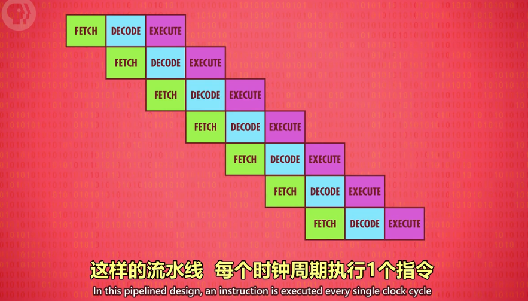
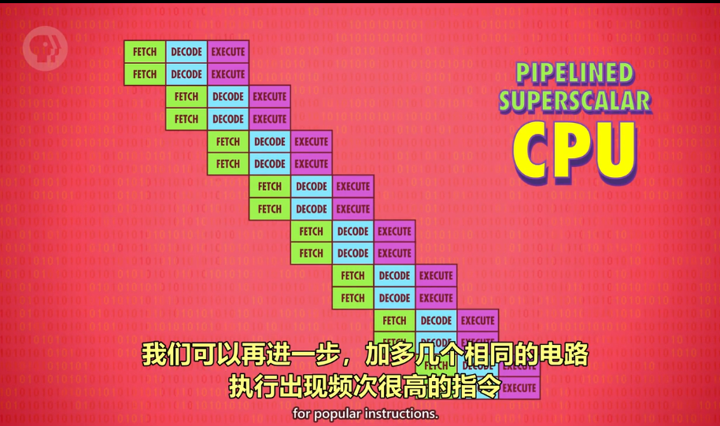

# 高级 CPU 设计

## 概念梳理

- 缓存：在 CPU 中的小块 RAM，用于存储批量指令。
  - 缓存命中：想要的数据已经在缓存里
  - 缓存未命中：想要的数据不在缓存里
  - 脏位：缓存里每块空间，有个特殊标记，叫脏位，用于检测缓存内的数据是否与 RAM 一致。
- 多核处理器：一个 CPU 芯片中，有多个独立处理单元。

---

## 现代 CPU 如何提升性能

早期通过**加快晶体管速度**，来提升 CPU 速度。但很快该方法到达了极限。

后来给 CPU 设计了**专门除法电路 + 其他电路**来做复杂操作：如游戏，视频解码。

---

## 缓存

为了不让 CPU 空等数据，在 CPU 内部设置了一小块内存，称为缓存，让 RAM 可以一次传输一批数据到 CPU 中。（不加缓存，CPU 没位置放大量数据）

缓存也可以当临时空间，存一些中间值，适合长/复杂的运算。

- 脏位：储存在缓存中与 RAM 不一致的数据
- 空等原因：从 RAM 到 CPU 的数据传输有延迟（要通过总线，RAM 还要时间找地址、取数据、配置、输出数据）。

---

## 缓存同步

缓存同步一般发生在 CPU 缓存已满，但 CPU 仍需往缓存内输入数据。此时，被标记为脏位的数据会优先传输回 RAM,腾出位置以防被覆盖，导致计算结果有误。

---

## 指令流水线

1. 作用：让取址 → 解码 → 执行三个步骤同时进行。并行执行指令，提升CPU性能。
2. 设计难点：数据具有依赖性、跳转程序
3. 数据依赖性解决方法：乱序运行、预测分支（高端 CPU）

---

## 批处理多条指令

---

## 同时运行多个指令流（多核 CPU）

**多核处理器**：一个 CPU 芯片中，有多个独立处理单元。但因为它们整合紧密，可以共享一些资源。

---

## 超级计算机（多个 CPU）

在一台计算机中，用无数个 CPU，做怪兽级的复杂运算，如模拟宇宙形成。
